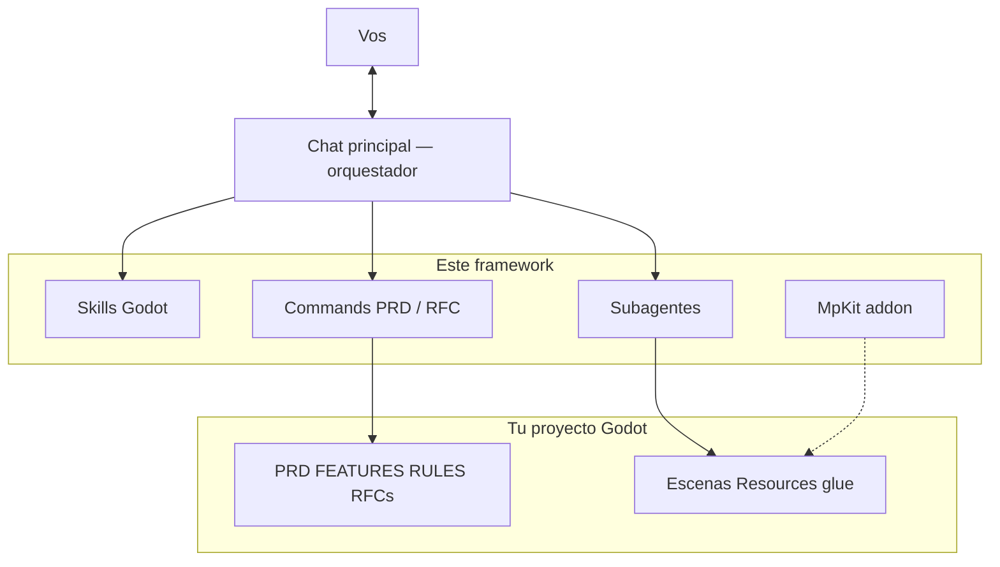
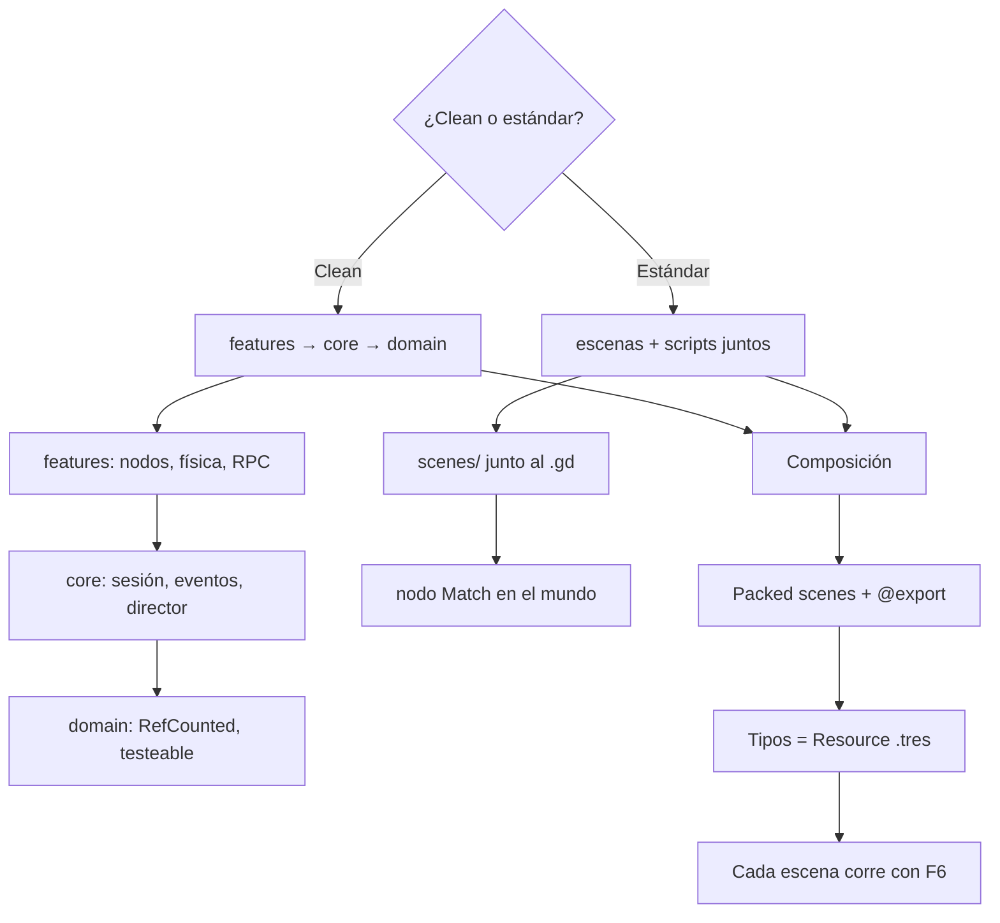
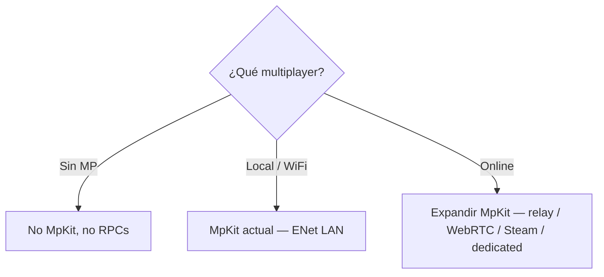
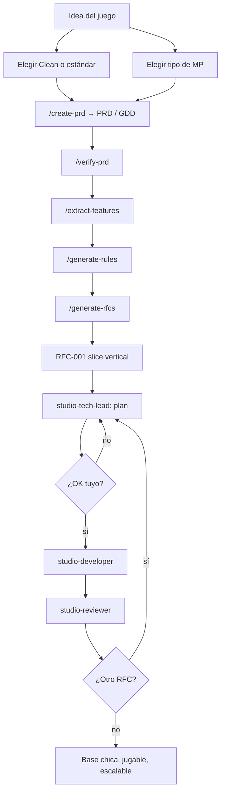

# Godot studio kit

Un estudio chico para **Cursor + Godot 4**: el chat no “hace el juego”, **orquesta**. Pregunta, escribe PRD/RFC, y reparte plan / código / review a subagentes. El resultado no es un `World.gd` de mil líneas: es una **base chica, jugable y clara**, que un humano (o otra IA) puede seguir desde el inspector.

Repo: https://github.com/Joelnicolass/godot-studio-skills

`main` está en inglés. Esta rama (`release/spanish`) está en español.

## Por qué existe

Sin este kit, un agente suele:

- asumir Clean Architecture o un género (wrap, CRT, plasma…)
- mezclar puntaje, spawn, FX y red en un solo script
- implementar el producto entero en un turno, sin PRD ni RFC

Con el kit:

- **vos** elegís Clean o estándar Godot **antes** de scaffoldear
- **vos** elegís si hay multiplayer y de qué tipo (sin MP · local/WiFi · online)
- cada feature es escena + `@export` + Resource `.tres`, no un `match kind`
- un RFC a la vez, con plan aprobado, review, y MpKit aparte del gameplay
- el juego vive en **otro** repo; acá solo hay skills, commands, agentes y el addon de transporte

| Pieza | Dónde | Qué es |
|-------|--------|--------|
| Orquestador | `skills/godot-studio-workflow/` | El agente del chat: entrevista + PRD→RFC→implementar |
| Cómo escribir Godot | `skills/` | Capas, composición, MpKit, tests (GUT/GdUnit4) |
| Subagentes | `agents/` | Tech lead, developer, reviewer; tester y visual opcionales |
| Commands | `commands/` | `/create-prd`, `/generate-rfcs`, `/implement-rfc`, … |
| MpKit | `addons/mp_kit/` | LAN / WiFi host-authoritative. **Cero** gameplay. No hace falta si no hay MP. Online = hay que expandirlo. |

Qué **no** entra acá: puntaje, copy, escenas de un título, `GameSession`, `SceneDirector`. Eso es glue del juego.

## Arquitectura del orquestador

El chat principal habla con vos. No implementa el título solo. Carga skills Godot, corre commands de producto, e invoca **un rol a la vez**.



Roles (`Task` → `subagent_type`):

| Rol | Subagente | Cuándo |
|-----|-----------|--------|
| Tech lead | `studio-tech-lead` | Plan de **un** RFC, sin código |
| Developer | `studio-developer` | Implementa ese plan |
| Reviewer | `studio-reviewer` | Después del código |
| Tester | `studio-tester` | Solo si pedís tests o RULES los exige |
| Visual | `studio-visual` | Solo si cambió HUD/menú/layout |

Los subagentes **no** ven este chat. El prompt les pasa repo, RFC, estilo de arquitectura, y que lean los artefactos.

## Arquitecturas Godot (siempre se pregunta)

Hay **dos** estilos válidos. El agente no asume Clean. En ambos mandan composición, editor y Resources.



| Estilo | Forma | Estado de partida |
|--------|--------|-------------------|
| **Clean** | `src/domain` + `core` + `features` | `GameSession` autoload **solo** si sobrevive el cambio de escena |
| **Estándar** | Escena + script juntos; sin `src/domain/` | Nodo `Match` hijo del mundo |

Dato de tipo → Resource. Helpers puros → `class_name` + `static func`. Comportamiento de actor → nodo hijo. Autoload solo para servicios globales (MpKit **si hay MP**, bus de eventos).

## Multiplayer (siempre se pregunta)

No copies `addons/mp_kit` “por las dudas”. Preguntá el tipo **antes** de RPCs o del addon.



| Tipo | MpKit |
|------|--------|
| **Sin multiplayer** | No se instala |
| **Local / WiFi** | El addon de este repo alcanza |
| **Online** (internet) | Hay que **expandir** el transporte del addon. Glue y `submit_*` siguen en el juego |

Tests: skill `godot-testing` (GUT / GdUnit4) **solo** si los pedís.

## Flujo general de desarrollo

De la idea a una base **jugable**. El primer RFC es el slice vertical, no infra eterna.



En un chat nuevo, con el kit instalado, pedí el juego. El orquestador corre esos commands **sin** que tipees cada slash. Tester y visual solo si los pedís. Alcance a mitad de obra: `/manage-changes`. Dónde estamos: `/workflow-status`.

Listo cuando: el slice se juega; cada feature es escena / componente / `.tres`; un humano abre el inspector y entiende.

## Prioridades (siempre)

- arquitectura fácil de escalar y limpia en capas
- siempre tienen prioridad las estructuras de composición
- siempre tienen prioridad los nodos y las configuraciones sobre el editor
- siempre se debe dar prioridad a la reusabilidad de los componentes

En **estándar**, “capas” no significa carpetas `domain/core/features`. Significa scripts chicos y composición.

## Instalar (Cursor)

```bash
./install.sh                 # ~/.cursor/skills, commands, agents
./install.sh --project       # ./.cursor/ del cwd
```

Desde GitHub:

```bash
npx skills add Joelnicolass/godot-studio-skills -g -a cursor -y
```

`npx skills` solo copia `skills/`. Commands, subagentes y el addon van con `./install.sh`.

Abrí un **chat nuevo** en Cursor después de instalar.

## Commands de producto

1. `/create-prd` → `PRD.md` (en juegos: GDD corto)
2. `/verify-prd` → `PRD-REVIEW.md`
3. `/extract-features` → `FEATURES.md`
4. `/generate-rules` → `RULES.md`
5. `/generate-rfcs` → `RFCs/` + `RFCS.md` (el primero es el slice vertical)
6. `/test-strategy` → opcional
7. `/implement-rfc <id>` (tubería de subagentes)
8. `/review-rfc <id>`
9. `/manage-changes` cuando se mueve el alcance
10. `/workflow-status`

## Shaders, sprites 2D y 3D

No inventar FX ni arte de memoria.

- Shaders: [Godot Shaders](https://godotshaders.com/shader/?orderby=date&order=DESC) primero; [Shadertoy](https://www.shadertoy.com) si hay que portar. Un pass = una packed scene.
- Sprites 2D: **preguntá** si querés MCP Aseprite / crear sprites, y pedí **referencias**. Animación: skill `godot-animation`. Sin OK: placeholder.
- **3D**: **preguntá** si querés el MCP de [Blender](https://www.blender.org/lab/mcp-server/). Si sí: instalalo (Blender 5.1 + add-on Lab + server en Cursor), pedí referencias, exportá `.glb` al juego. Sin OK: placeholder. Detalle: `skills/godot-composition-first/assets.md`.

## Instalar MpKit en un proyecto Godot

```bash
./install.sh --addon /path/to/godot-project
```

Autoload **antes** del glue:

```
MpKit="*res://addons/mp_kit/mp_kit.gd"
```

## Layout

```
addons/mp_kit/
skills/
  godot-studio-workflow/
  godot-layered-architecture/
  godot-composition-first/
  godot-mp-kit/
  godot-testing/
  godot-animation/
agents/                        # studio-tech-lead, studio-developer, …
commands/
install.sh
```

Cómo crece el framework: extraer a `addons/` o `skills/` cuando algo se reusa. No copiar un FX o un tracker de puntaje “por las dudas”.
