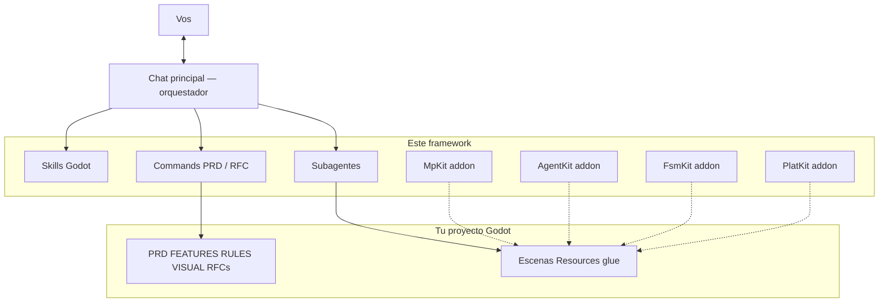
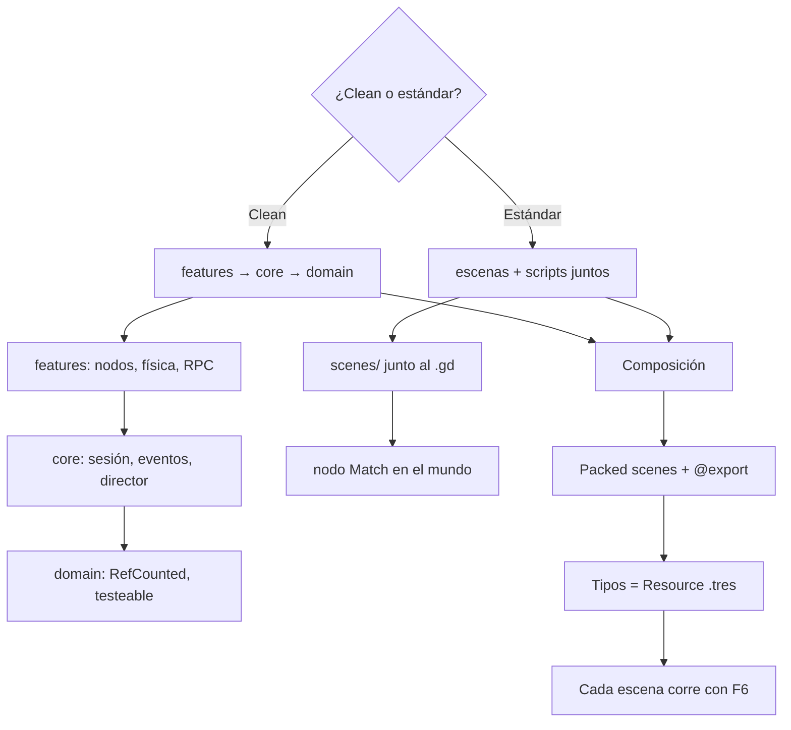
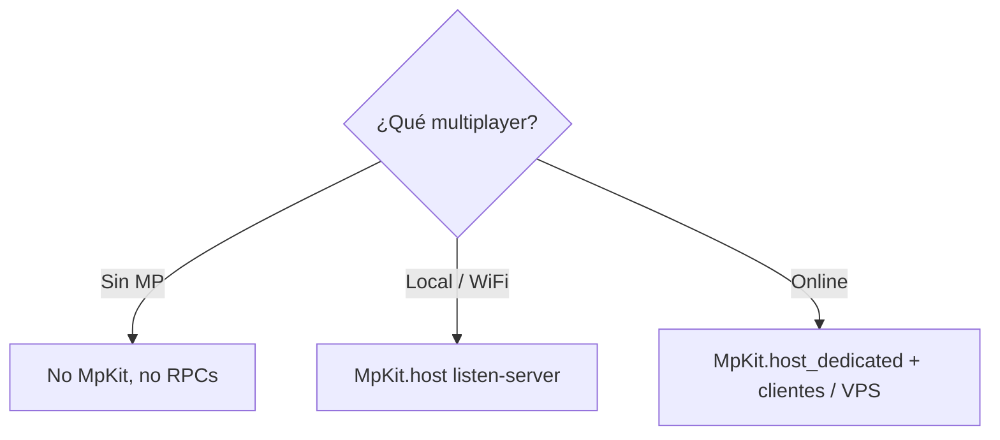
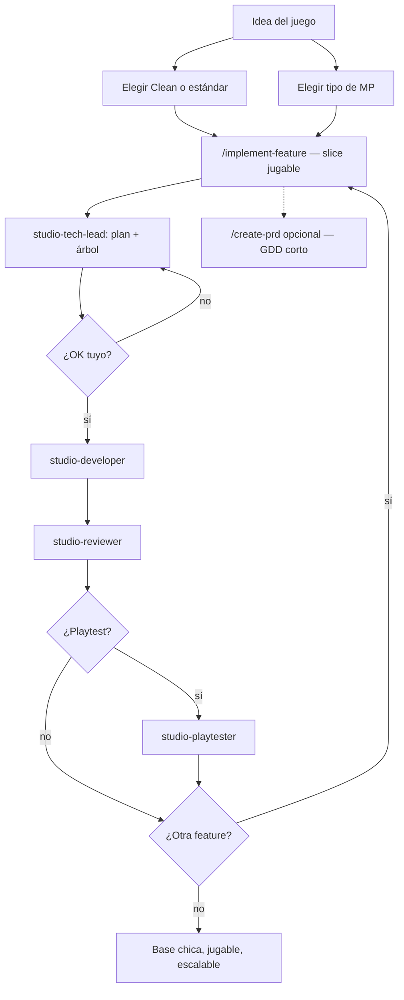

# Godot studio kit

Un estudio chico para **Cursor + Godot 4**: el chat no “hace el juego”, **orquesta**. Pregunta, escribe PRD/RFC, y reparte plan / código / review a subagentes. El resultado no es un `World.gd` de mil líneas: es una **base chica, jugable y clara**, que un humano (o otra IA) puede seguir desde el inspector.

Repo: https://github.com/Joelnicolass/godot-studio-skills

`main` está en inglés. Esta rama (`release/spanish`) está en español.

## Por qué existe

Sin este kit, un agente suele:

- asumir Clean Architecture o un género (wrap, CRT, plasma…)
- mezclar puntaje, spawn, FX y red en un solo script
- implementar el producto entero en un turno, sin PRD ni RFC

Con el kit:

- **vos** elegís Clean o estándar Godot **antes** de scaffoldear
- **vos** elegís si hay multiplayer y de qué tipo (sin MP · local/WiFi · online)
- cada feature es escena + `@export` + Resource `.tres`, no un `match kind`
- un RFC a la vez, con **árbol de archivos** aprobado, review, playtest y pase visual si los pedís
- MpKit aparte del gameplay; notas entre chats en Engram o `.studio/MEMORY.md` si hace falta
- el juego vive en **otro** repo; acá solo hay skills, commands, agentes y addons (MpKit, AgentKit, FsmKit, PlatKit)

| Pieza | Dónde | Qué es |
|-------|--------|--------|
| Orquestador | `skills/godot-studio-workflow/` | El agente del chat: entrevista + `/implement-feature` (PRD/RFC opcionales) |
| Cómo escribir Godot | `skills/` | Capas, composición, MpKit, AgentKit, FSM, plataformas 2D, juicy, playtest, visual, memoria, tests |
| Subagentes | `agents/` | Tech lead, developer, reviewer; tester, playtester y visual opcionales |
| Commands | `commands/` | `/implement-feature`, `/add-juicy`, `/add-state-machine`, `/add-platformer-2d`, `/create-prd`, … |
| MpKit | `addons/mp_kit/` | Listen o dedicated, nodos de replicación, túnel Dictionary. **Cero** gameplay. |
| AgentKit | `addons/agent_kit/` | CLI para agentes: captura, flow (`try_click` / `repeat`), HTTP, inspect, diff. **Cero** gameplay. |
| FsmKit | `addons/fsm_kit/` | `FsmMachine` + `FsmState`. Sin autoload. |
| PlatKit | `addons/plat_kit/` | Motor 2D: coyote, buffer, apex, corner, lift. Sin niveles ni puntaje. |

Qué **no** entra acá: puntaje, copy, escenas de un título, `GameSession`, `SceneDirector`. Eso es glue del juego.

## Arquitectura del orquestador

El chat principal habla con vos. No implementa el título solo. Carga skills Godot, corre commands de producto, e invoca **un rol a la vez**.



Roles (`Task` → `subagent_type`):

| Rol | Subagente | Cuándo |
|-----|-----------|--------|
| Tech lead | `studio-tech-lead` | Plan de **un** RFC **con árbol**, sin código |
| Developer | `studio-developer` | Implementa ese plan |
| Reviewer | `studio-reviewer` | Después del código (un pase) |
| Tester | `studio-tester` | Solo si pedís tests o RULES los exige |
| Playtester | `studio-playtester` | Solo si aceptás jugar el build (no es GUT) |
| Visual | `studio-visual` | Solo si pedís pase UI; hace falta `VISUAL.md` o refs |

Los subagentes **no** ven este chat. El prompt les pasa repo, RFC, estilo de arquitectura, y que lean los artefactos.

## Arquitecturas Godot (siempre se pregunta)

Hay **dos** estilos válidos. El agente no asume Clean. En ambos mandan composición, editor y Resources.



| Estilo | Forma | Estado de partida |
|--------|--------|-------------------|
| **Clean** | `src/domain` + `core` + `features` | `GameSession` autoload **solo** si sobrevive el cambio de escena |
| **Estándar** | Escena + script juntos; sin `src/domain/` | Nodo `Match` hijo del mundo |

Dato de tipo → Resource. Helpers puros → `class_name` + `static func`. Comportamiento de actor → nodo hijo. Autoload solo para servicios globales (MpKit **si hay MP**, bus de eventos).

## Multiplayer (siempre se pregunta)

No copies `addons/mp_kit` “por las dudas”. Preguntá el tipo **antes** de RPCs o del addon.



| Tipo | MpKit |
|------|--------|
| **Sin multiplayer** | No se instala |
| **Local / WiFi** | `host()` — el proceso host es un jugador |
| **Online** (internet / VPS) | `host_dedicated()` — mismo proyecto, peer 1 no es jugador. Desarrollá dedicated + clientes; la VPS es el mismo binario |

Tests: skill `godot-testing` (GUT / GdUnit4) **solo** si los pedís.

## Flujo general de desarrollo

De la idea a una base **jugable**. **Iterar gana a un PRD con todo definido.** El camino corto es `/implement-feature`. PRD/RFC siguen siendo opcionales.



En un chat nuevo, con el kit instalado, pedí el juego o **una feature**. El orquestador corre `/implement-feature` **sin** exigir un GDD completo. Playtest y visual: el orquestador **pregunta**. Tester GUT solo si los pedís. Un RFC grande: `/implement-rfc`. Alcance a mitad de un RFC: `/manage-changes`. Dónde estamos: `/workflow-status`.

Listo cuando: el slice se juega; cada feature es escena / componente / `.tres`; un humano abre el inspector y entiende.

## Prioridades (siempre)

- arquitectura fácil de escalar y limpia en capas
- siempre tienen prioridad las estructuras de composición
- siempre tienen prioridad los nodos y las configuraciones sobre el editor
- siempre se debe dar prioridad a la reusabilidad de los componentes

En **estándar**, “capas” no significa carpetas `domain/core/features`. Significa scripts chicos y composición.

## Instalar (Cursor)

```bash
./install.sh                 # ~/.cursor/skills, commands, agents
./install.sh --project       # ./.cursor/ del cwd
```

Desde GitHub:

```bash
npx skills add Joelnicolass/godot-studio-skills -g -a cursor -y
```

`npx skills` solo copia `skills/`. Commands, subagentes y los addons van con `./install.sh`.

Abrí un **chat nuevo** en Cursor después de instalar.

## Commands de producto

Camino corto (default):

1. `/implement-feature` — una feature o el slice vertical (árbol → OK → código → review). Crece `FEATURES.md`.
2. `/add-juicy` — feel jugoso (shake, VFX, post, impacto) sobre un evento que ya existe
3. `/add-state-machine` — `FsmMachine` + estados hijos (addon FsmKit)
4. `/add-platformer-2d` — coyote, jump buffer, apex, corner (addon PlatKit)
5. `/new-mp-feature` — solo scaffold de un actor MpKit
6. `/workflow-status`
7. `/agent-kit` — capturas, flows, fetch, inspect (addon AgentKit)

Contrato escrito, si lo pedís:

8. `/create-prd` → `PRD.md` (GDD **corto y vivo**, no el título entero)
9. `/verify-prd` → `PRD-REVIEW.md`
10. `/extract-features` → `FEATURES.md`
11. `/generate-rules` → `RULES.md`
12. `/create-visual-guide` → `VISUAL.md`
13. `/generate-rfcs` → `RFCs/` + `RFCS.md`
14. `/implement-rfc <id>`
15. `/review-rfc <id>`
16. `/manage-changes`
17. `/test-strategy` — opcional

## Shaders, sprites 2D y 3D

No inventar FX ni arte de memoria.

- Shaders: [Godot Shaders](https://godotshaders.com/shader/?orderby=date&order=DESC) primero; [Shadertoy](https://www.shadertoy.com) si hay que portar. Un pass = una packed scene.
- Sprites 2D: **preguntá** si querés MCP Aseprite / crear sprites, y pedí **referencias**. Animación: skill `godot-animation`. Feel jugoso: `/add-juicy` + skill `godot-juicy`. Sin OK: placeholder.
- **3D**: **preguntá** si querés el MCP de [Blender](https://www.blender.org/lab/mcp-server/). Si sí: instalalo (Blender 5.1 + add-on Lab + server en Cursor), pedí referencias, exportá `.glb` al juego. Sin OK: placeholder. Detalle: `skills/godot-composition-first/assets.md`.

## Instalar MpKit en un proyecto Godot

```bash
./install.sh --addon /path/to/godot-project
```

Habilitá el plugin **MpKit** (autoload + Tools). CI/headless:

```
MpKit="*res://addons/mp_kit/mp_kit.gd"
```

Hay una demo lista en [`example/`](example/README.md) (1P, LAN, dedicated, mundos 2D y 3D con placeholders, flujo PRD→RFC).

Snippets Cursor/VS Code: `.vscode/mpkit.code-snippets` (el instalador los copia). Editor: `skills/godot-mp-kit/editor.md`. Online / VPS: `skills/godot-mp-kit/dedicated.md`.

## Instalar AgentKit en un proyecto Godot

```bash
./install.sh --addon /path/to/godot-project agent_kit
```

Habilitá el plugin **AgentKit**. CLI: `addons/agent_kit/cli.sh PROJECT capture --out=/tmp/a.png`. Un flow largo (subasta, turnos) usa `try_click` y `repeat` — ver `addons/agent_kit/README.md` y skill `godot-agent-kit`. No uses `godot -s /tmp` para capturas.

## FsmKit / PlatKit

```bash
./install.sh --addon /path/to/godot-project fsm_kit
./install.sh --addon /path/to/godot-project plat_kit
```

Habilitá **FsmKit** / **PlatKit**. Commands: `/add-state-machine`, `/add-platformer-2d`. PlatKit no es un clon de Celeste: dash/stamina quedan en el juego.

## Editor de flow (experimental)

Vite + React en localhost para armar el JSON que corre el playtester (`--agent=flow`), vincular `%UniqueName` / InputMap y **Run flow** contra Godot. **No** entra en `./install.sh`. Instalación con **pnpm** (`node_modules/` está en `.gitignore`).

```bash
cd experimental/agent-flow-editor
pnpm install
pnpm dev
```

http://localhost:5173 — detalle: [`experimental/agent-flow-editor/README.md`](experimental/agent-flow-editor/README.md).

## Layout

```
example/                       # demo Godot 4.7 (1P + LAN + dedicated, 2D y 3D)
addons/mp_kit/
addons/agent_kit/
addons/fsm_kit/
addons/plat_kit/
skills/
  godot-studio-workflow/
  godot-studio-memory/
  godot-layered-architecture/
  godot-composition-first/
  godot-mp-kit/
  godot-agent-kit/
  godot-playtest/
  godot-visual-qa/
  godot-testing/
  godot-animation/
  godot-juicy/
  godot-fsm/
  godot-platformer-2d/
experimental/agent-flow-editor/  # Vite + pnpm; no va en ./install.sh; ignorá node_modules
agents/                        # studio-tech-lead, studio-developer, studio-playtester, …
commands/
install.sh
```

Cómo crece el framework: extraer a `addons/` o `skills/` cuando algo se reusa. No copiar un FX o un tracker de puntaje “por las dudas”.
