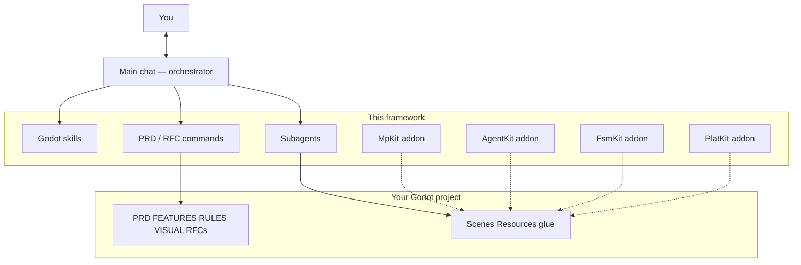
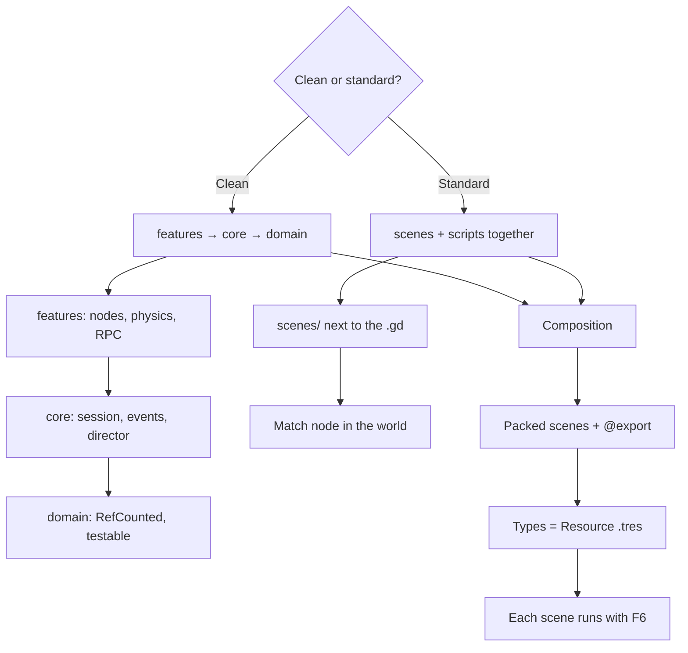
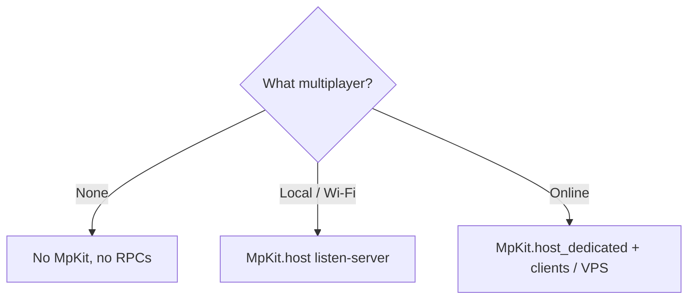
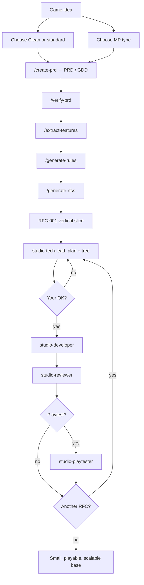

# Godot studio kit

A small studio for **Cursor + Godot 4**: the chat does not “make the game”, it **orchestrates**. It interviews you, writes PRD/RFCs, and hands plan / code / review to subagents. The result is not a thousand-line `World.gd`: it is a **small, playable, clear base** that a human (or another AI) can continue from the inspector.

Repo: https://github.com/Joelnicolass/godot-studio-skills

Two principal branches: `main` (English) and `release/spanish` (Spanish). **Never** push work straight to them. Order: an RC pair — `rc/vX.Y.Z` from `main` and `rc/vX.Y.Z-spanish` from `release/spanish` — and merge to the principals only after the RC is accepted. A second candidate: `rc/vX.Y.Z-rc.2`.

## Why this exists

Without the kit, an agent often:

- assumes Clean Architecture or a leftover genre (wrap, CRT, plasma…)
- mixes score, spawn, FX, and netcode in one script
- implements the whole product in one turn, with no PRD or RFC

With the kit:

- **you** choose Clean or standard Godot **before** any scaffold
- **you** choose whether there is multiplayer and which type (none · local/Wi-Fi · online)
- each feature is a scene + `@export` + Resource `.tres`, not a `match kind`
- one RFC at a time, with a **file tree** approved, review, playtest and visual pass if you ask
- MpKit kept off gameplay; notes across chats in Engram or `.studio/MEMORY.md` if needed
- the game lives in **another** repo; this one only has skills, commands, agents, and addons (MpKit, AgentKit, FsmKit, PlatKit)

| Piece | Where | What it is |
|-------|--------|--------|
| Orchestrator | `skills/godot-studio-workflow/` | The chat agent: interview + `/implement-feature` (PRD/RFC optional) |
| How to write Godot | `skills/` | Layers, composition, MpKit, AgentKit, FSM, 2D platformer, juicy, playtest, visual, memory, tests |
| Subagents | `agents/` | Tech lead, developer, reviewer; optional tester, playtester, and visual |
| Commands | `commands/` | `/implement-feature`, `/add-juicy`, `/add-state-machine`, `/add-platformer-2d`, `/create-prd`, … |
| MpKit | `addons/mp_kit/` | Listen or dedicated, replication nodes, Dictionary tunnel. **Zero** gameplay. |
| AgentKit | `addons/agent_kit/` | CLI for agents: capture, flow (`try_click` / `repeat`), HTTP, inspect, diff. **Zero** gameplay. |
| FsmKit | `addons/fsm_kit/` | `FsmMachine` + `FsmState`. No autoload. |
| PlatKit | `addons/plat_kit/` | 2D motor: coyote, buffer, apex, corner, lift. No levels or score. |

What **does not** belong here: score, product copy, a title’s scenes, `GameSession`, `SceneDirector`. That is game glue.

## Orchestrator architecture

The main chat talks to you. It does not implement the title alone. It loads Godot skills, runs product commands, and invokes **one role at a time**.



Roles (`Task` → `subagent_type`):

| Role | Subagent | When |
|------|----------|------|
| Tech lead | `studio-tech-lead` | Plan for **one** RFC **with a tree**, no code |
| Developer | `studio-developer` | Implements that plan |
| Reviewer | `studio-reviewer` | After the code (one pass) |
| Tester | `studio-tester` | Only if you ask for tests or RULES requires them |
| Playtester | `studio-playtester` | Only if you agree to play the build (not GUT) |
| Visual | `studio-visual` | Only if you ask for a UI pass; needs `VISUAL.md` or refs |

Subagents **do not** see this chat. The prompt passes repo, RFC, architecture style, and tells them to read the artifacts.

## Godot architectures (always ask)

Two styles are valid. The agent does not assume Clean. Both require composition, the editor, and Resources.



| Style | Shape | Match state |
|--------|--------|-------------|
| **Clean** | `src/domain` + `core` + `features` | `GameSession` autoload **only** if it survives scene change |
| **Standard** | Scene + script together; no `src/domain/` | `Match` node, child of the world |

Type data → Resource. Pure helpers → `class_name` + `static func`. Actor behavior → child node. Autoload only for global services (MpKit **if there is MP**, event bus).

## Multiplayer (always ask)

Do not copy `addons/mp_kit` “just in case”. Ask the type **before** RPCs or the addon.



| Type | MpKit |
|------|--------|
| **No multiplayer** | Do not install |
| **Local / Wi-Fi** | `host()` — the host process is a player |
| **Online** (internet / VPS) | `host_dedicated()` — same project, peer 1 is not a player. Develop dedicated + clients; the VPS is the same binary |

Tests: skill `godot-testing` (GUT / GdUnit4) **only** if you ask.

## Development flow

From idea to a **playable** base. The first RFC is the vertical slice, not endless infra.



In a new chat, with the kit installed, ask for the game. The orchestrator runs those commands **without** you typing every slash. Playtest and visual: the orchestrator **asks**. GUT tester only if you ask. Scope mid-build: `/manage-changes`. Where we are: `/workflow-status`.

Done when: the slice plays; each feature is a scene / component / `.tres`; a human opens the inspector and follows.

## Priorities (always)

- architecture that is easy to scale and clean in layers
- composition structures always take priority
- nodes and editor configuration always take priority
- component reusability always takes priority

On **standard**, “layers” does not mean `domain/core/features` folders. It means small scripts and composition.

## Install (Cursor)

```bash
./install.sh                 # ~/.cursor/skills, commands, agents
./install.sh --project       # ./.cursor/ of cwd
```

From GitHub:

```bash
npx skills add Joelnicolass/godot-studio-skills -g -a cursor -y
```

`npx skills` only copies `skills/`. Commands, subagents, and the addons go through `./install.sh`.

Open a **new chat** in Cursor after installing.

## Product commands

Short path (default):

1. `/implement-feature` — one feature or the vertical slice (tree → OK → code → review). Grows `FEATURES.md`.
2. `/add-juicy` — juicy feel (shake, VFX, post, impact) on an event that already exists
3. `/add-state-machine` — `FsmMachine` + child states (FsmKit addon)
4. `/add-platformer-2d` — coyote, jump buffer, apex, corner (PlatKit addon)
5. `/new-mp-feature` — MpKit actor scaffold only
6. `/workflow-status`
7. `/agent-kit` — screenshots, flows, fetch, inspect (AgentKit addon)

Written contract, if you ask:

8. `/create-prd` → `PRD.md` (short **living** GDD, not the whole title)
9. `/verify-prd` → `PRD-REVIEW.md`
10. `/extract-features` → `FEATURES.md`
11. `/generate-rules` → `RULES.md`
12. `/create-visual-guide` → `VISUAL.md`
13. `/generate-rfcs` → `RFCs/` + `RFCS.md`
14. `/implement-rfc <id>`
15. `/review-rfc <id>`
16. `/manage-changes`
17. `/test-strategy` — optional

## Shaders, 2D sprites, and 3D

Do not invent FX or art from memory.

- Shaders: [Godot Shaders](https://godotshaders.com/shader/?orderby=date&order=DESC) first; [Shadertoy](https://www.shadertoy.com) if you need to port. One pass = one packed scene.
- 2D sprites: **ask** if you want Aseprite MCP / sprite creation, and ask for **references**. Animation: skill `godot-animation`. Juicy feel: `/add-juicy` + skill `godot-juicy`. Without OK: placeholder.
- **3D**: **ask** if you want the [Blender](https://www.blender.org/lab/mcp-server/) MCP. If yes: install it (Blender 5.1 + Lab add-on + server in Cursor), ask for references, export `.glb` into the game. Without OK: placeholder. Details: `skills/godot-composition-first/assets.md`.

## Install MpKit in a Godot project

```bash
./install.sh --addon /path/to/godot-project
```

Enable the **MpKit** plugin (autoload + Tools). CI/headless:

```
MpKit="*res://addons/mp_kit/mp_kit.gd"
```

A ready demo lives in [`example/`](example/README.md) (1P, LAN, dedicated, 2D and 3D worlds with placeholders, PRD→RFC flow).

Cursor/VS Code snippets: `.vscode/mpkit.code-snippets` (the installer copies them). Editor: `skills/godot-mp-kit/editor.md`. Online / VPS: `skills/godot-mp-kit/dedicated.md`.

## Install AgentKit in a Godot project

```bash
./install.sh --addon /path/to/godot-project agent_kit
```

Enable the **AgentKit** plugin. CLI: `addons/agent_kit/cli.sh PROJECT inspect --unique` and `flow --fail-on-error`. A long flow (auction, turns) uses `try_click` and `repeat` — see `addons/agent_kit/README.md` and skill `godot-agent-kit`. Do not use `godot -s /tmp` for captures.

## FsmKit / PlatKit

```bash
./install.sh --addon /path/to/godot-project fsm_kit
./install.sh --addon /path/to/godot-project plat_kit
```

Enable **FsmKit** / **PlatKit**. Commands: `/add-state-machine`, `/add-platformer-2d`. PlatKit is not a Celeste clone: dash/stamina stay in the game.

## Flow editor (experimental)

Vite + React on localhost to build the JSON the playtester runs (`--agent=flow`), bind `%UniqueName` / InputMap, and **Run flow** against Godot. **Not** part of `./install.sh`. Install with **pnpm** (`node_modules/` is gitignored).

```bash
cd experimental/agent-flow-editor
pnpm install
pnpm dev
```

http://localhost:5173 — details: [`experimental/agent-flow-editor/README.md`](experimental/agent-flow-editor/README.md).

## Layout

```
example/                       # Godot 4.7 demo (1P + LAN + dedicated, 2D and 3D)
addons/mp_kit/
addons/agent_kit/
addons/fsm_kit/
addons/plat_kit/
skills/
  godot-studio-workflow/
  godot-studio-memory/
  godot-layered-architecture/
  godot-composition-first/
  godot-mp-kit/
  godot-agent-kit/
  godot-playtest/
  godot-visual-qa/
  godot-testing/
  godot-animation/
  godot-juicy/
  godot-fsm/
  godot-platformer-2d/
experimental/agent-flow-editor/  # Vite + pnpm; not in ./install.sh; ignore node_modules
agents/                        # studio-tech-lead, studio-developer, studio-playtester, …
commands/
install.sh
```

How the framework grows: extract into `addons/` or `skills/` when something is reused. Do not copy an FX or a score tracker “just in case”.
