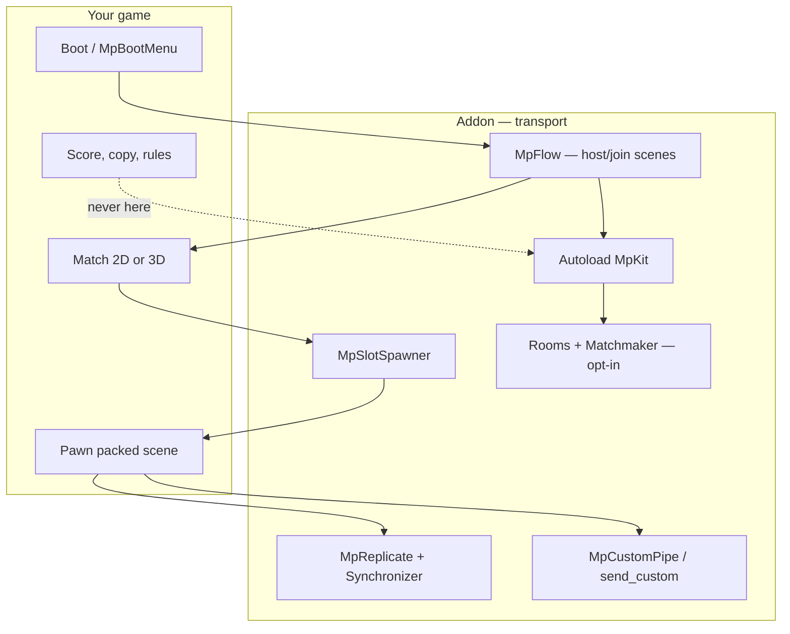
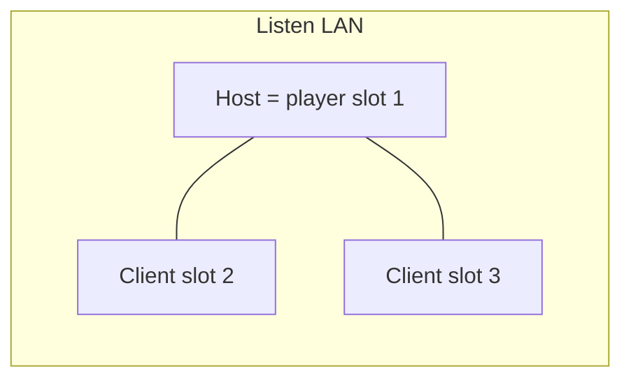
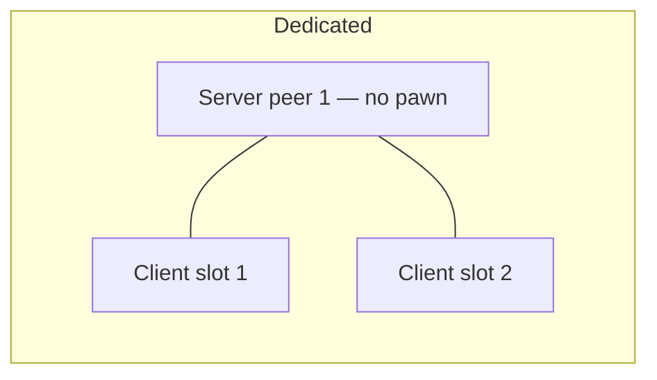
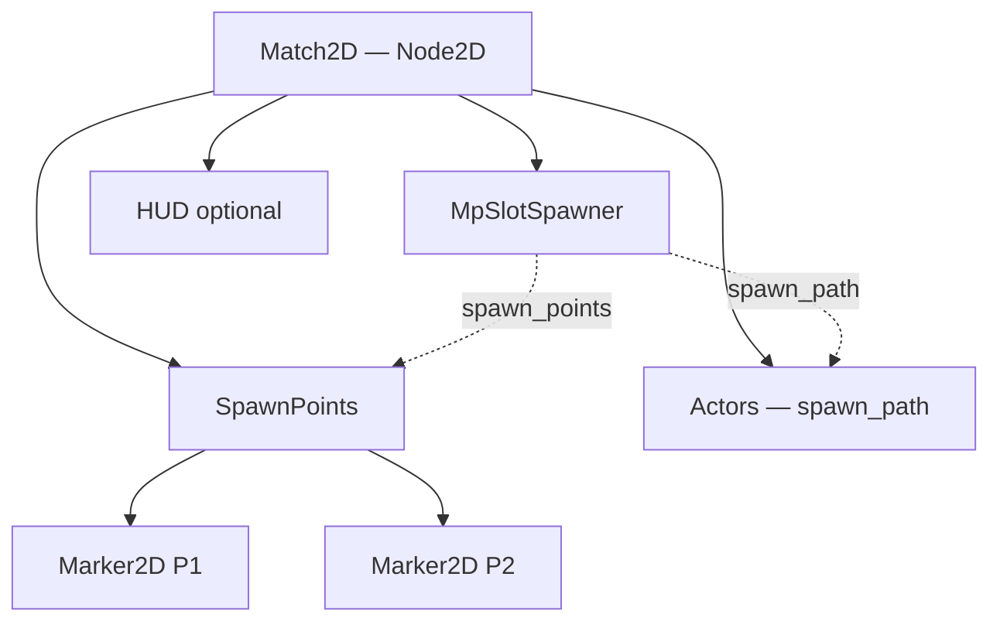
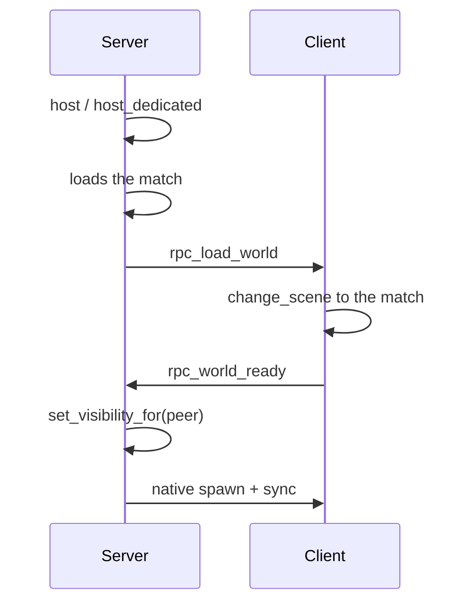
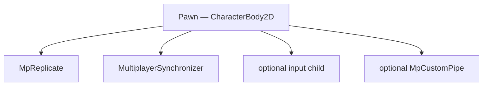
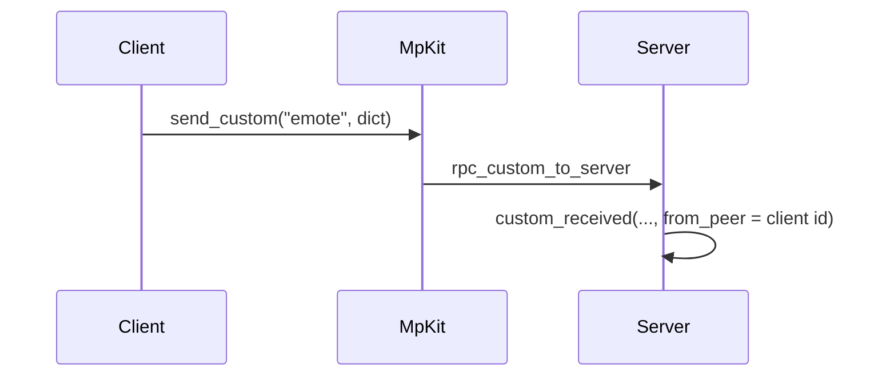
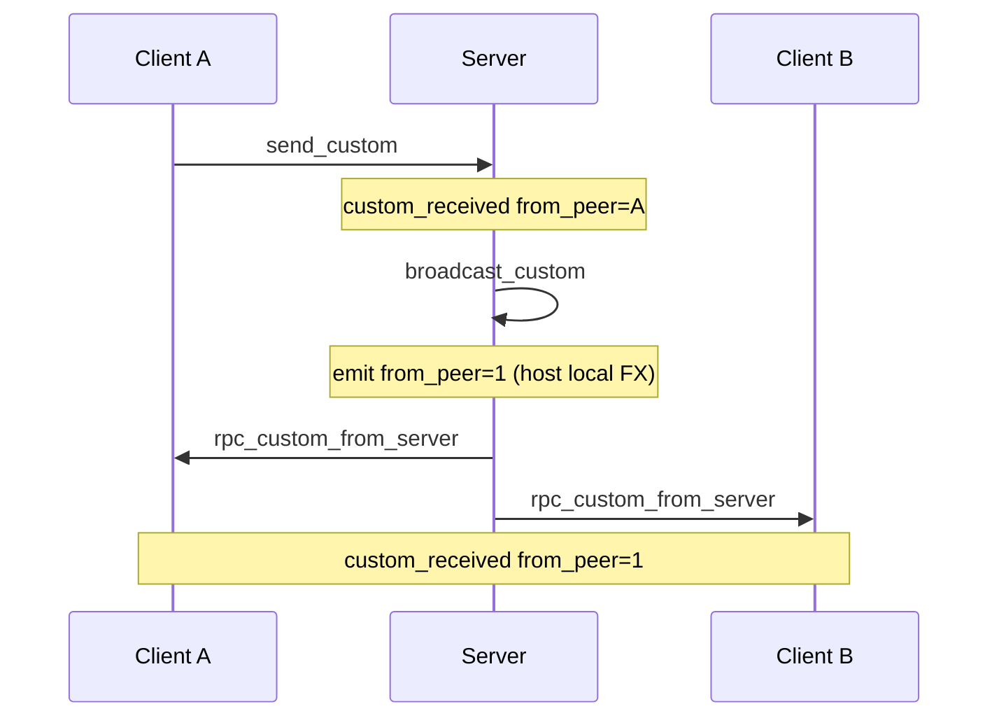
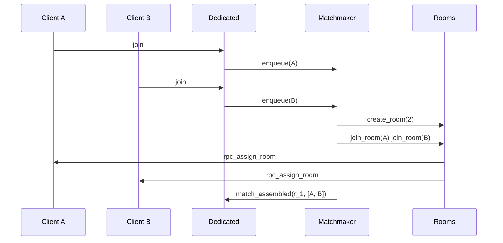
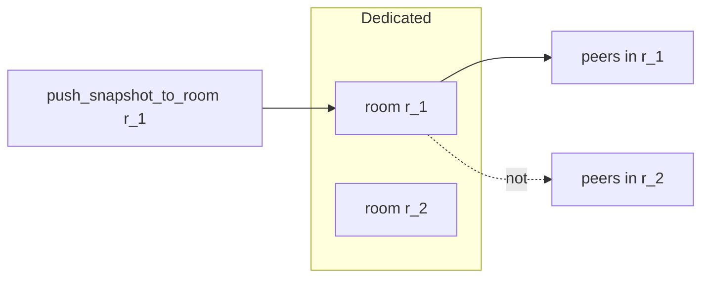

# MpKit — informal multiplayer kit (Godot 4)

Canonical copy: this repo (`addons/mp_kit`). Host-authoritative helpers. **No gameplay** in `mp_kit.gd`: no scores, copy, or pawns. `MpFlow` only changes boot/world scenes.

Do **not** install for a 1P-only game.

This guide is for **manual setup in the editor**. Code identifiers stay in English.

## Contents

1. [Install](#install)
2. [Two server modes](#two-server-modes)
3. [Mental map](#mental-map)
4. [Step-by-step (human)](#step-by-step-human)
5. [Custom Dictionary tunnel](#custom-dictionary-tunnel)
6. [What goes on each channel](#what-goes-on-each-channel)
7. [Tools menu](#tools-menu)
8. [Addon pieces](#addon-pieces)
9. [Hub rooms and queue (optional)](#hub-rooms-and-queue-optional)

## Install

```bash
./install.sh --addon /path/to/godot-project
```

Or copy this folder to `res://addons/mp_kit/` and enable **MpKit** in Project → Project Settings → Plugins.

```
MpKit="*res://addons/mp_kit/mp_kit.gd"
```

The `MpKit` autoload goes **before** `MpFlow` (or your subclass). For CI/headless keep the line in `project.godot`; do not also Enable if that would duplicate it.

1. `MpKit.configure(port, max_players)` (`MpFlow` does this if you use it) **before** `host()` / `host_dedicated()` / `join()`.
2. Optional 4th argument: `PackedStringArray` of tunnel channel names (empty = all allowed).
3. **Do not** put game rules in `mp_kit.gd`.

Online = dedicated with a public IP and open UDP. Locally: `godot --headless --path . -- --dedicated` and clients to `127.0.0.1`.

Cursor skill: `skills/godot-mp-kit/`.

## Two server modes

Same ENet, **same project** as the clients:

| Mode | API | Who is a player |
|------|-----|-----------------|
| **Listen-server** (LAN / same Wi-Fi) | `MpKit.host()` | The host process is slot 1 / peer 1 |
| **Dedicated** (online / VPS) | `MpKit.host_dedicated()` | Peer 1 is **not** a player. Slots go to `join()` clients |

1P: do **not** call `host()`. `MpKit.leave()` leaves an `OfflineMultiplayerPeer`.

Several matches at once on **one** dedicated process: [Hub rooms and queue](#hub-rooms-and-queue-optional). One match at a time: you can ignore that.

## Mental map







## Step-by-step (human)

Do this in Godot, in order. One world is enough; several worlds use the catalog at the end of step 3.

### 1. Plugin and autoload

1. Copy `addons/mp_kit/` into the project.
2. Project → Settings → Plugins → **MpKit** (Enable).
3. Project → Settings → Autoload: `MpKit` must exist pointing at `res://addons/mp_kit/mp_kit.gd`.
4. Project → Tools → **MpKit: New session flow...**  
   Or create an `MpFlow` node by hand, save it as `res://glue/session_flow.tscn`, and add it as an autoload **after** MpKit.

On the flow inspector:

| Property | What to set |
|----------|-------------|
| `boot_path` | `res://scenes/ui/boot.tscn` |
| `world_path` | your match, if there is **one** world |
| `worlds` | list of `MpWorldRef` if you have **several** maps (`id` + scene or path) |
| `max_players` | e.g. 4 |
| `room_name` | name people see on LAN |
| `advertise_lan` | on |
| `custom_channels` | e.g. `emote` if you will use the tunnel; empty = all |
| `start_when` | Listen: enter on host. Dedicated: **Dedicated first client** |

Several maps: in the lobby `select_world(&"2d")`. The joiner receives `world_id` only. Process arg: `--world=3d`.

### 2. Boot scene (lobby)

Option A — drop-in: instance `res://addons/mp_kit/mp_boot_menu.tscn`. If `MpFlow` is already an autoload, the menu uses it.

Option B — by hand:

1. Full-screen `Control`. Buttons: Play solo, Host LAN, Join + IP `LineEdit`.
2. In the script:

```gdscript
func _on_play_solo() -> void:
	MpFlow.play_solo()

func _on_host() -> void:
	MpFlow.host_lan()

func _on_join() -> void:
	MpFlow.join_lan(%Ip.text)

func _ready() -> void:
	var beacon := MpLan.browse(self)
	beacon.rooms_changed.connect(_on_rooms)
```

3. LAN list: when picking a row, put `address` in the LineEdit. Click Join. That list is **LAN browse** (`MpLan.rooms_changed`), not hub rooms on `MpKit.rooms`.
4. Dedicated: `MpFlow` calls `host_dedicated()` on its own. The menu can hide if `MpBoot.is_dedicated_process()`.

### 3. Match scene

Typical tree:



1. Root `Node2D` or `Node3D` (the world).
2. Child `Actors` (empty). Replicated pawns go there.
3. Child `SpawnPoints` with one `Marker2D`/`Marker3D` per slot (P1, P2, …).
4. **Add child** → `MpSlotSpawner` (it is a `MultiplayerSpawner`).
5. Spawner inspector:

| Property | Value |
|----------|--------|
| `spawn_path` | `../Actors` (pawn parent) |
| `pawn_scene` | your `pawn_2d.tscn` / `pawn_3d.tscn` |
| `spawn_points` | `../SpawnPoints` |
| `hold_until_world_ready` | **on** (default) |
| `despawn_on_leave` | on if you want the pawn deleted on leave |

You do not need an `MpWorldReady` node. The spawner asks for `world_ready` on the client.

Dedicated does **not** spawn slot 0. Listen host spawns its pawn in `_ready`. Joiners, on `client_world_ready`.

Handshake (do not implement this: the kit already does it):



### 4. Pawn (replicated actor)

1. Packed scene: `CharacterBody2D` or `CharacterBody3D`.
2. Collision + visual. `@export var player_slot: int = 1`.
3. Select the root → Project → Tools → **MpKit: Wire replication on selection**.  
   That adds a child `MpReplicate` + `MultiplayerSynchronizer`.
4. In the synchronizer **Replication** dock (or in the `.tscn`):

| Path | spawn | replication |
|------|-------|-------------|
| `.:position` | yes | on change / always |
| `.:rotation` | yes | on change |
| `.:visible` | yes | on change |
| `.:player_slot` | **yes** | never (spawn only) |

5. `MpReplicate` inspector: `interpolate` on for proxies (the host does not interpolate).
6. Input **only** if `player_slot == MpKit.local_slot()` (or an input child that already does that).
7. Commands to the server:

```gdscript
func try_move(dir: Vector2) -> void:
	if MpAuthority.should_send_command():
		submit_move.rpc_id(1, dir)
	else:
		apply_move(dir)

@rpc("any_peer", "call_remote", "reliable")
func submit_move(dir: Vector2) -> void:
	if not MpAuthority.accept_command(self, player_slot):
		return
	apply_move(dir)
```

- `call_remote`: the local host does **not** double the RPC.
- Dedicated never sends `submit_*` (no local player).
- Pawn/bullet types: Resource `.tres` on the actor, not a `kind` string over RPC.

Pawn tree:



### 5. HUD and leave

A Leave button: `MpFlow.return_to_boot()`.  
HUD: `MpKit.local_slot()` (0 = dedicated process). Never use `get_unique_id()` as a player id.

### 6. Try it

| Mode | How |
|------|-----|
| 1P | F5 → Play solo. No `create_server`. |
| LAN | Debug → Run Multiple Instances. A: Host LAN. B: room from the list or `127.0.0.1`. |
| Dedicated | `godot --headless --path . -- --dedicated` and a client Join `127.0.0.1`. |

## Custom Dictionary tunnel

Use it for **opaque** data that is not actor transform and not a gameplay `submit_*`: emote, UI ping, your own handshake, debug.

The kit **does not read** the dict. It **does not auto-forward**. If the server does not call `broadcast_custom`, the other peers never see it.

### API

| Who | Method | What happens |
|-----|--------|----------------|
| Client, 1P, or the server itself | `MpKit.send_custom(channel, data)` | Client → RPC to the server. 1P / server: emits `custom_received` **locally** (`from_peer` 1 or your unique id). |
| Server only | `MpKit.broadcast_custom(channel, data)` | Emits on the server (`from_peer` = 1) **and** sends to every client. |
| Server only | `MpKit.push_custom_to(peer_id, channel, data)` | One client. The server does **not** emit locally. |
| Everyone | signal `MpKit.custom_received(channel, data, from_peer)` | That is where you receive. |

Allowlist: `configure(..., PackedStringArray(["emote"]))`. Empty = any name. Unknown name = dropped.

Convenient node: child `MpCustomPipe`, `@export channel = &"emote"`.

| Pipe | Equals |
|------|--------|
| `pipe.send(data)` | `MpKit.send_custom(channel, data)` |
| `pipe.broadcast(data)` | `MpKit.broadcast_custom` (no-op if you are not the server) |
| `pipe.push_to(peer, data)` | `MpKit.push_custom_to` |
| signal `packet(data, from_peer)` | `custom_received` filtered to that channel |

### Send (client → server)

```gdscript
# On the pawn / feature (client or 1P)
$MpCustomPipe.send({"slot": player_slot, "msg": "hello"})
```



In 1P or if the listen host calls it: no RPC; it emits right there. That is why the host usually uses `broadcast` when **everyone** should see it (including clients).

### Receive

```gdscript
func _ready() -> void:
	MpKit.custom_received.connect(_on_custom)

func _on_custom(channel: StringName, data: Dictionary, from_peer: int) -> void:
	if channel != &"emote":
		return
	# from_peer == 1  → the server pushed it (broadcast or local send)
	# from_peer == 2+ → it arrived from that client, not yet “on everyone”
```

Or on the actor: `$MpCustomPipe.packet.connect(_on_emote)`.

### Sync to everyone (the server forwards)

Without this step, only the server saw the client’s packet.

```gdscript
func _on_custom(channel: StringName, data: Dictionary, from_peer: int) -> void:
	if channel != &"emote":
		return
	if MpKit.is_server() and from_peer != 1:
		MpKit.broadcast_custom(channel, data)
```

`from_peer != 1` is required. `broadcast_custom` emits again with `from_peer = 1`. If you also forward that emit, the server calls itself in a loop (the kit stops re-entry, but you would still duplicate logic).



One peer only: `push_custom_to(peer_id, channel, data)` (the server does not see it locally; if the host must also react, `broadcast_custom` or your own emit).

### Actor pattern (like the demo emote)

```gdscript
func try_emote() -> void:
	var data := {"slot": player_slot, "msg": "hello"}
	if not MpKit.is_networked() or not MpKit.is_server():
		$MpCustomPipe.send(data)      # 1P or client → server
		return
	$MpCustomPipe.broadcast(data)     # listen host: everyone

func _on_emote_packet(data: Dictionary, from_peer: int) -> void:
	if int(data.get("slot", 0)) != player_slot:
		return
	if MpKit.is_networked() and MpKit.is_server() and from_peer != 1:
		return   # server waits for the broadcast (from_peer 1) so it does not flash twice
	_flash()
```

The glue (autoload) still does the reflect `from_peer != 1` → `broadcast_custom`. The actor does not forward.

## What goes on each channel

| Data | Where |
|------|--------|
| Position, rotation, visible | `MultiplayerSynchronizer` (`MpReplicate`) |
| “I want to move / shoot” | `submit_*` on **your** pawn + `accept_command` |
| Weapon type / look | Resource `.tres` on the actor, `spawn = true` if needed at spawn |
| Timer / score / lives | One match: `MpKit.push_snapshot`. Several rooms: `MpKit.rooms.push_snapshot_to_room` |
| Emote, ping, debug | Custom tunnel. Several rooms: `push_custom_to_room`, not `broadcast_custom` |
| When the match starts | `MpFlow.start_when` / `start_match()`, or `match_assembled` if you use the queue |

Do not put meshes, scores, or bullet `kind` in the tunnel.

## Tools menu

With the plugin enabled, **Project → Tools**:

- **Wire replication on selection** — child `MpReplicate` + `MultiplayerSynchronizer`
- **New replicated feature...** — `res://features/<id>/<id>.gd` + `.tscn`
- **New session flow...** — `MpFlow` autoload (`res://glue/session_flow.tscn`)
- **Install Cursor/VS Code snippets** — `.vscode/mpkit.code-snippets`

Enable copies templates to `res://script_templates/` (CharacterBody / Node2D / Node3D / Node).

## Addon pieces

| File | Role |
|------|------|
| `mp_kit.gd` | ENet + slots + session RPCs + Dictionary tunnel. Children `Rooms` / `Matchmaker`. |
| `mp_ids.gd` | slot ↔ peer |
| `mp_room_directory.gd` | hub rooms (opt-in); room seat ≠ hub slot |
| `mp_matchmaker.gd` | FIFO queue; opens a room when `party_size` is reached |
| `mp_boot.gd` | detect dedicated process |
| `mp_flow.gd` | scenes, host/join/1P, world catalog |
| `mp_world_ref.gd` | one world in the catalog |
| `mp_replicate.gd` | authority + sync + freeze + proxy lerp |
| `mp_spawner.gd` | MultiplayerSpawner + hold until `world_ready` |
| `mp_slot_spawner.gd` | one packed pawn per occupied slot |
| `mp_boot_menu.gd` / `.tscn` | drop-in lobby |
| `mp_custom_pipe.gd` | one tunnel channel |
| `mp_lan.gd` / `mp_lan_beacon.gd` | IPv4 + UDP advertise/browse |
| `mp_authority.gd` | `accept_command`, `accept_room_command`, freeze, sync |
| `mp_world_ready.gd` | leftover (no-op if an `MpSpawner` is present) |

Spawn handshake: `hold_until_world_ready` (actors hidden until `client_world_ready`; Godot sends spawn + sync together). Dedicated: no pawn for peer 1. Do not reparent actors in glue.

## Hub rooms and queue (optional)

Use this when **one** `host_dedicated()` must run **several matches at once** in the same process (1v1 queue, 2v2, a code for a friend).

If your game is one match per server, **leave this alone**. The `example/` does not call `enqueue` or `create_room`.

This is not the LAN list on the boot menu. That is `MpLan.browse` → `rooms_changed` (name + IP of a listen host). Hub rooms live on `MpKit.rooms`.

The kit **groups peers**. It does not change scene, instance N worlds, or keep score. That is glue.

### What shows up on its own

On boot, `MpKit` creates two children. You do not add these nodes by hand.

```
/root/MpKit
├── Rooms        # MpRoomDirectory — seats + code. Has an RPC
└── Matchmaker   # MpMatchmaker    — FIFO queue. No RPCs
```

`MpKit.leave()` clears the directory and the queue; it does **not** free these nodes.

### Four different IDs (do not mix them)

| Name | What it is | Example |
|------|------------|---------|
| ENet `peer_id` | RPC routing | `2`, `3`, `4` |
| Hub **slot** (`local_slot()`) | Connection to this process. Dedicated: clients `1..max_players` | slot 3 |
| Room **id** + **seat** | Room and seat **inside that room** | `r_1`, seat `0` or `1` |
| Room **code** | Join by hand (uppercase, no `0 O 1 I`) | `K7P2` |

The HUD “you are player 1 of this match” uses the **seat**, not `local_slot()`.

`max_players` is **hub connections**, not party size. 16 rooms of 2 = `configure(..., 32)`.

### Inspector (Remote, while playing)

With the dedicated process running: Remote tree → `MpKit` → `Rooms` / `Matchmaker`.

| Node | Property | Default | What for |
|------|----------|---------|----------|
| `Rooms` | `max_rooms` | 16 | Room cap (empty rooms still count until `close_room`) |
| `Rooms` | `seats_per_room` | 2 | Seats if `create_room()` is called with no size |
| `Rooms` | `code_length` | 4 | Code length |
| `Matchmaker` | `party_size` | 2 | How many the queue pulls to open a room |

From glue, before enqueueing:

```gdscript
MpKit.rooms.max_rooms = 16
MpKit.rooms.seats_per_room = 2
MpKit.matchmaker.party_size = 2
```

### Path A — automatic queue

The server puts peers in the queue. When `party_size` is reached, the kit opens the room **immediately** (no Accept button, no nick, no `change_scene`).

```gdscript
func _ready() -> void:
	super._ready()
	MpKit.peer_joined.connect(_on_peer_joined)
	MpKit.matchmaker.match_assembled.connect(_on_match)

func _on_peer_joined(peer_id: int, _slot: int) -> void:
	if not MpKit.is_server():
		return
	MpKit.matchmaker.enqueue(peer_id)

func _on_match(room_id: StringName, peer_ids: PackedInt32Array) -> void:
	# glue: spawn / logic for THAT room. peer_ids are already seated 0..n-1
	print(room_id, MpKit.rooms.code_for_room(room_id), peer_ids)
```

`enqueue` ignores a peer already queued or already seated. Disconnect → drop from the queue. If `create_room` fails (room cap), they **stay queued** and there is no `match_assembled`.



### Path B — private code

No queue. The server creates an empty room, you give a friend the code, glue seats whoever sends it.

```gdscript
# server (room host, or an operator)
var room_id := MpKit.rooms.create_room(2)
var code := MpKit.rooms.code_for_room(room_id)
# show `code` in UI / copy to clipboard — the kit has no screen for this

# when a client sends the code (your tunnel or submit_*):
func _seat_with_code(peer_id: int, code: String) -> void:
	if MpKit.rooms.join_room_by_code(peer_id, code) != OK:
		return
```

The client gets `MpKit.rooms.room_assigned(room_id, seat)` (RPC). `create_room` seats **nobody**.

Room full → `room_ready` on the server. `leave_room` frees the seat and does **not** close the room. `close_room` unseats everyone and deletes it (so it stops counting toward `max_rooms`).

### Sync data only to that room

`push_snapshot` / `broadcast_custom` reach the **whole hub**. With several matches that leaks data. Use:

```gdscript
MpKit.rooms.push_snapshot_to_room(room_id, {"elapsed": t})
MpKit.rooms.push_custom_to_room(room_id, &"emote", data)
```



### Gameplay commands in a room

`submit_*` for a single-match game still uses `accept_command(self, player_slot)` (**hub** slot).

If the pawn is a room seat:

```gdscript
@rpc("any_peer", "call_remote", "reliable")
func submit_move(dir: Vector2) -> void:
	if not MpAuthority.accept_room_command(self, room_id, seat):
		return
	apply_move(dir)
```

`accept_command` is not replaced: they are two different checks.

### Try it locally

1. Dedicated: `godot --headless --path . -- --dedicated` (`max_players` ≥ connected people).
2. Two (or `party_size`) clients Join `127.0.0.1`.
3. In the server debugger: `MpKit.matchmaker.enqueue(MpKit.peer_id_for(1))` and the same for slot 2 → one `r_1`. Another pair → `r_2`.
4. Code path: `create_room()` + `join_room_by_code` with a 4-char string.

### What not to do

- Use `local_slot()` as the match seat.
- `push_snapshot` / `broadcast_custom` to the whole hub if there is more than one room.
- Expect the kit to open a match scene per room.
- Put Steam, WebRTC, or one Godot process per match in the addon. No score / title copy here.
