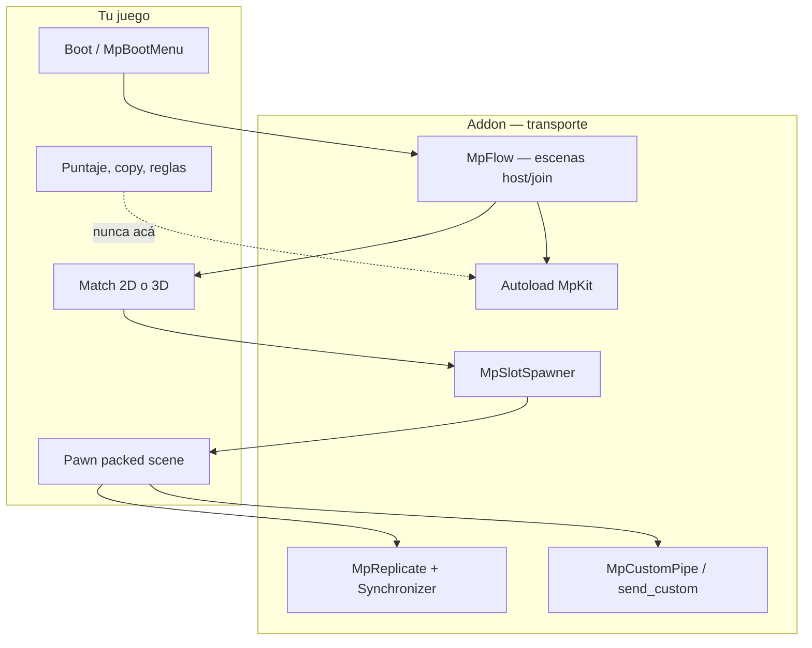
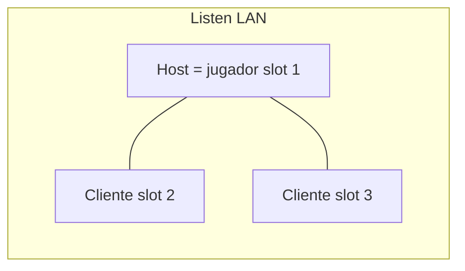
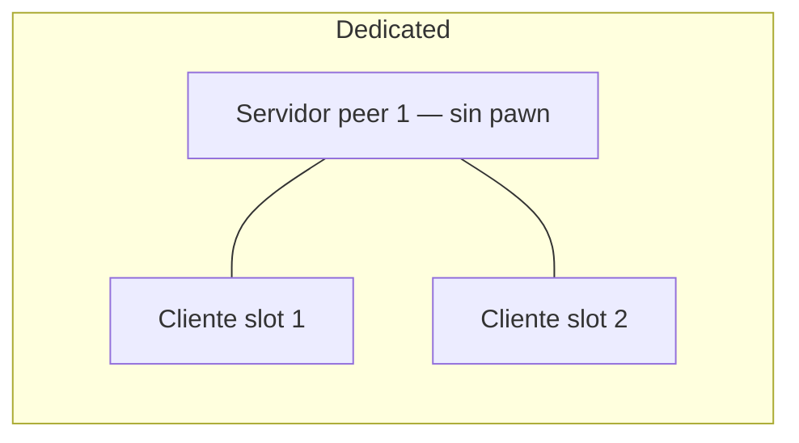
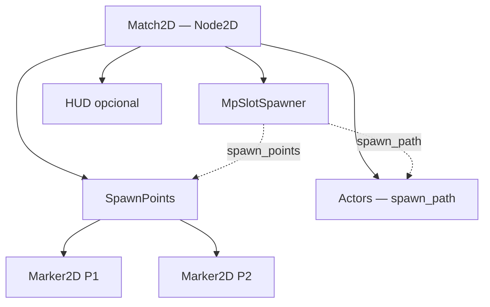
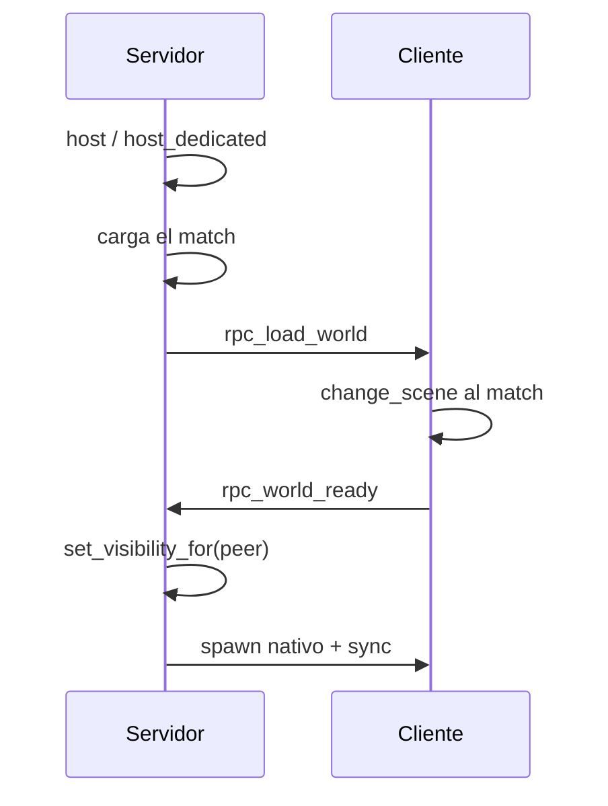
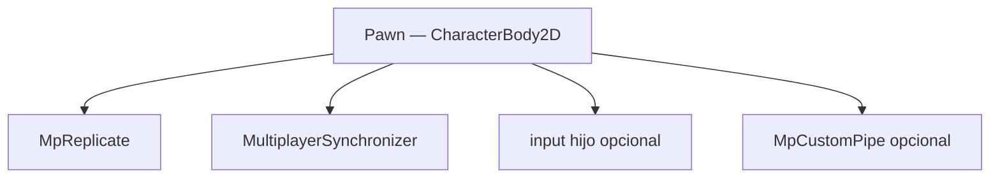
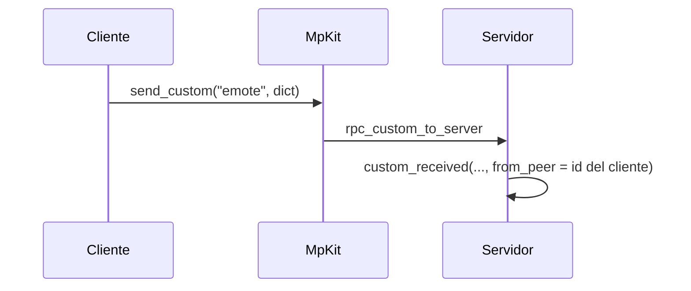
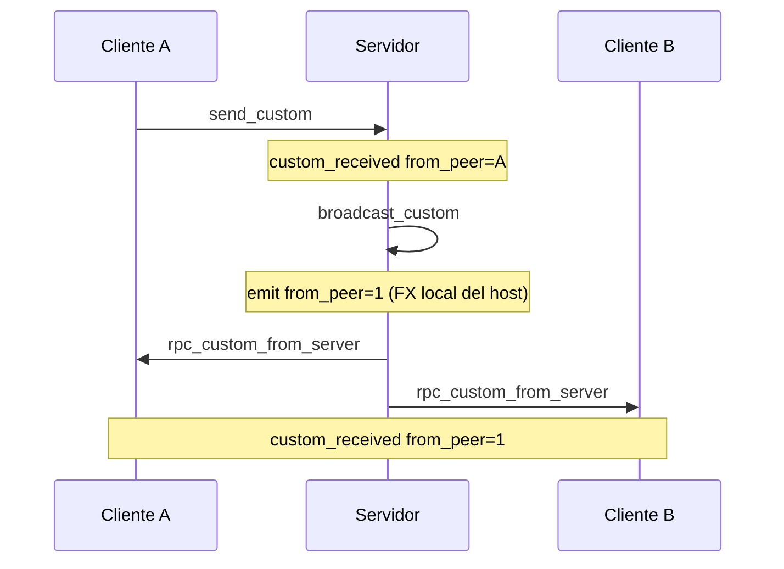

# MpKit — kit informal de multiplayer (Godot 4)

Copia canónica: este repo (`addons/mp_kit`). Ayudas host-authoritative. **Cero gameplay** en `mp_kit.gd`: ni puntaje, ni copy, ni pawns. `MpFlow` solo cambia escenas de boot/mundo.

**No** lo instales en un juego 1P puro.

Esta guía es para **configuración manual en el editor**. Los identificadores de código quedan en inglés.

## Índice

1. [Instalar](#instalar)
2. [Dos modos de servidor](#dos-modos-de-servidor)
3. [Mapa mental](#mapa-mental)
4. [Guía paso a paso (humano)](#guía-paso-a-paso-humano)
5. [Túnel custom (Dictionary)](#túnel-custom-dictionary)
6. [Qué va por cada canal](#qué-va-por-cada-canal)
7. [Menú Tools](#menú-tools)
8. [Piezas del addon](#piezas-del-addon)

## Instalar

```bash
./install.sh --addon /path/to/godot-project
```

O copiá esta carpeta a `res://addons/mp_kit/` y enable **MpKit** en Proyecto → Ajustes del proyecto → Plugins.

```
MpKit="*res://addons/mp_kit/mp_kit.gd"
```

El autoload `MpKit` va **antes** de `MpFlow` (o tu subclase). En CI/headless dejá la línea en `project.godot`; no dupliques Enable + línea manual.

1. `MpKit.configure(port, max_players)` (lo hace `MpFlow` si lo usás) **antes** de `host()` / `host_dedicated()` / `join()`.
2. 4.º argumento opcional: `PackedStringArray` de nombres de canal del túnel (vacío = todos permitidos).
3. **No** metas reglas de juego en `mp_kit.gd`.

Online = dedicated con IP pública y UDP abierto. En local: `godot --headless --path . -- --dedicated` y clientes a `127.0.0.1`.

Skill Cursor: `skills/godot-mp-kit/`.

## Dos modos de servidor

Mismo ENet, **mismo proyecto** que los clientes:

| Modo | API | Quién es jugador |
|------|-----|------------------|
| **Listen-server** (LAN / mismo Wi-Fi) | `MpKit.host()` | El proceso host es slot 1 / peer 1 |
| **Dedicated** (online / VPS) | `MpKit.host_dedicated()` | Peer 1 **no** es jugador. Los slots van a clientes `join()` |

1P: **no** llames `host()`. `MpKit.leave()` deja `OfflineMultiplayerPeer`.

## Mapa mental







## Guía paso a paso (humano)

Hacé esto en Godot, en orden. Un mundo alcanza; varios mundos usan el catálogo al final del paso 3.

### 1. Plugin y autoload

1. Copiá `addons/mp_kit/` al proyecto.
2. Proyecto → Ajustes → Plugins → **MpKit** (Enable).
3. Proyecto → Ajustes → Autoload: tiene que existir `MpKit` apuntando a `res://addons/mp_kit/mp_kit.gd`.
4. Project → Tools → **MpKit: New session flow...**  
   O creá a mano un nodo `MpFlow`, guardalo como `res://glue/session_flow.tscn`, y agregalo de autoload **después** de MpKit.

En el inspector del flow:

| Propiedad | Qué poner |
|-----------|-----------|
| `boot_path` | `res://scenes/ui/boot.tscn` |
| `world_path` | tu match, si hay **un** mundo |
| `worlds` | lista de `MpWorldRef` si hay **varios** mapas (`id` + escena o path) |
| `max_players` | p.ej. 4 |
| `room_name` | nombre que verán en LAN |
| `advertise_lan` | on |
| `custom_channels` | p.ej. `emote` si vas a usar el túnel; vacío = todos |
| `start_when` | Listen: entra al hostear. Dedicated: **Dedicated first client** |

Varios mapas: en el lobby `select_world(&"2d")`. El joiner recibe `world_id` solo. Arg de proceso: `--world=3d`.

### 2. Escena de boot (lobby)

Opción A — drop-in: instancia `res://addons/mp_kit/mp_boot_menu.tscn`. Si ya hay `MpFlow`, el menú lo usa.

Opción B — a mano:

1. `Control` a pantalla completa. Botones: Jugar solo, Host LAN, Unirse + `LineEdit` de IP.
2. En el script:

```gdscript
func _on_play_solo() -> void:
	MpFlow.play_solo()

func _on_host() -> void:
	MpFlow.host_lan()

func _on_join() -> void:
	MpFlow.join_lan(%Ip.text)

func _ready() -> void:
	var beacon := MpLan.browse(self)
	beacon.rooms_changed.connect(_on_rooms)
```

3. Lista LAN: al elegir una fila, poné `address` en el LineEdit. Click Unirse.
4. Dedicated: `MpFlow` hace `host_dedicated()` solo. El menú puede ocultarse si `MpBoot.is_dedicated_process()`.

### 3. Escena de match

Árbol típico:



1. Raíz `Node2D` o `Node3D` (el mundo).
2. Hijo `Actors` (vacío). Ahí van los pawns replicados.
3. Hijo `SpawnPoints` con un `Marker2D`/`Marker3D` por slot (P1, P2, …).
4. **Crear nodo** → `MpSlotSpawner` (es un `MultiplayerSpawner`).
5. Inspector del spawner:

| Propiedad | Valor |
|-----------|--------|
| `spawn_path` | `../Actors` (el padre de los pawns) |
| `pawn_scene` | tu `pawn_2d.tscn` / `pawn_3d.tscn` |
| `spawn_points` | `../SpawnPoints` |
| `hold_until_world_ready` | **on** (default) |
| `despawn_on_leave` | on si querés borrar el pawn al irse |

No hace falta un nodo `MpWorldReady`. El spawner pide `world_ready` en el cliente.

Dedicated **no** spawnea slot 0. Listen host spawnea su pawn en `_ready`. Los que se unen, en `client_world_ready`.

Handshake (no lo implementes: el kit ya lo hace):



### 4. Pawn (actor replicado)

1. Escena packed: `CharacterBody2D` o `CharacterBody3D`.
2. Collision + visual. `@export var player_slot: int = 1`.
3. Seleccioná la raíz → Project → Tools → **MpKit: Wire replication on selection**.  
   Eso agrega hijo `MpReplicate` + `MultiplayerSynchronizer`.
4. En el dock **Replication** del synchronizer (o en el `.tscn`):

| Path | spawn | replication |
|------|-------|-------------|
| `.:position` | sí | on change / always |
| `.:rotation` | sí | on change |
| `.:visible` | sí | on change |
| `.:player_slot` | **sí** | never (solo al nacer) |

5. Inspector de `MpReplicate`: `interpolate` on para proxies (el host no interpola).
6. Input **solo** si `player_slot == MpKit.local_slot()` (o un hijo de input que ya lo haga).
7. Comandos al servidor:

```gdscript
func try_move(dir: Vector2) -> void:
	if MpAuthority.should_send_command():
		submit_move.rpc_id(1, dir)
	else:
		apply_move(dir)

@rpc("any_peer", "call_remote", "reliable")
func submit_move(dir: Vector2) -> void:
	if not MpAuthority.accept_command(self, player_slot):
		return
	apply_move(dir)
```

- `call_remote`: el host local **no** duplica el RPC.
- Dedicated nunca manda `submit_*` (no hay jugador local).
- Tipos de pawn/bala: Resource `.tres` en el actor, no un string `kind` por RPC.

Árbol del pawn:



### 5. HUD y salir

Un botón Salir: `MpFlow.return_to_boot()`.  
HUD: `MpKit.local_slot()` (0 = proceso dedicated). Nunca `get_unique_id()` como id de jugador.

### 6. Probar

| Modo | Cómo |
|------|------|
| 1P | F5 → Jugar solo. Sin `create_server`. |
| LAN | Debug → Run Multiple Instances. A: Host LAN. B: sala de la lista o `127.0.0.1`. |
| Dedicated | `godot --headless --path . -- --dedicated` y un cliente Join `127.0.0.1`. |

## Túnel custom (Dictionary)

Sirve para datos **opacos** que no son transform del actor ni un `submit_*` de gameplay: emote, ping de UI, un handshake vuestro, debug.

El kit **no lee** el dict. **No reenvía solo**. Si el servidor no hace `broadcast_custom`, el resto de peers no se enteran.

### API

| Quién | Método | Qué pasa |
|-------|--------|----------|
| Cliente, 1P, o el propio servidor | `MpKit.send_custom(channel, data)` | Cliente → RPC al servidor. 1P / servidor: emite `custom_received` **en local** (`from_peer` 1 o tu unique id). |
| Solo servidor | `MpKit.broadcast_custom(channel, data)` | Emite en el servidor (`from_peer` = 1) **y** manda a todos los clientes. |
| Solo servidor | `MpKit.push_custom_to(peer_id, channel, data)` | Un cliente. El servidor **no** emite en local. |
| Todos | señal `MpKit.custom_received(channel, data, from_peer)` | Ahí recibís. |

Allowlist: `configure(..., PackedStringArray(["emote"]))`. Vacío = cualquier nombre. Nombre desconocido = se descarta.

Nodo cómodo: hijo `MpCustomPipe`, `@export channel = &"emote"`.

| Pipe | Equivale a |
|------|------------|
| `pipe.send(data)` | `MpKit.send_custom(channel, data)` |
| `pipe.broadcast(data)` | `MpKit.broadcast_custom` (no-op si no sos servidor) |
| `pipe.push_to(peer, data)` | `MpKit.push_custom_to` |
| señal `packet(data, from_peer)` | filtro de `custom_received` a ese canal |

### Mandar (cliente → servidor)

```gdscript
# En el pawn / feature (cliente o 1P)
$MpCustomPipe.send({"slot": player_slot, "msg": "hola"})
```



En 1P o si lo llama el listen host: no hay RPC; se emite ahí mismo. Por eso el host suele usar `broadcast` cuando quiere que **todos** lo vean (incluídos los clientes).

### Recibir

```gdscript
func _ready() -> void:
	MpKit.custom_received.connect(_on_custom)

func _on_custom(channel: StringName, data: Dictionary, from_peer: int) -> void:
	if channel != &"emote":
		return
	# from_peer == 1  → lo empujó el servidor (broadcast o send local)
	# from_peer == 2+ → llegó de ese cliente, todavía no está “en todos”
```

O en el actor: `$MpCustomPipe.packet.connect(_on_emote)`.

### Sincronizar al resto (el servidor reenvía)

Sin este paso, solo el servidor vio el paquete del cliente.

```gdscript
func _on_custom(channel: StringName, data: Dictionary, from_peer: int) -> void:
	if channel != &"emote":
		return
	if MpKit.is_server() and from_peer != 1:
		MpKit.broadcast_custom(channel, data)
```

`from_peer != 1` es obligatorio. `broadcast_custom` emite otra vez con `from_peer = 1`. Si reenviás también ese emit, el servidor se llama a sí mismo en bucle (el kit corta el re-entrante, pero igual duplicarías lógica).



Un peer solo: `push_custom_to(peer_id, channel, data)` (el servidor no lo ve en local; si el host también debe reaccionar, `broadcast_custom` o un emit vuestro).

### Patrón en el actor (como el emote de la demo)

```gdscript
func try_emote() -> void:
	var data := {"slot": player_slot, "msg": "hola"}
	if not MpKit.is_networked() or not MpKit.is_server():
		$MpCustomPipe.send(data)      # 1P o cliente → servidor
		return
	$MpCustomPipe.broadcast(data)     # listen host: todos

func _on_emote_packet(data: Dictionary, from_peer: int) -> void:
	if int(data.get("slot", 0)) != player_slot:
		return
	if MpKit.is_networked() and MpKit.is_server() and from_peer != 1:
		return   # el servidor espera el broadcast (from_peer 1) para no flash 2 veces
	_flash()
```

El glue (autoload) sigue haciendo el reflect `from_peer != 1` → `broadcast_custom`. El actor no reenvía.

## Qué va por cada canal

| Dato | Dónde |
|------|--------|
| Posición, rotación, visible | `MultiplayerSynchronizer` (`MpReplicate`) |
| “Quiero mover / disparar” | `submit_*` en **tu** pawn + `accept_command` |
| Tipo de arma / look | Resource `.tres` en el actor, `spawn = true` si hace falta al nacer |
| Timer / score / vidas | `MpKit.push_snapshot` 2–10 Hz (dict vuestro) |
| Emote, ping, debug | Túnel custom |
| Cuándo empieza la partida | `MpFlow.start_when` / `start_match()`, no el túnel |

No metas meshes, puntaje ni `kind` de bala en el túnel.

## Menú Tools

Con el plugin enabled, **Project → Tools**:

- **Wire replication on selection** — hijo `MpReplicate` + `MultiplayerSynchronizer`
- **New replicated feature...** — `res://features/<id>/<id>.gd` + `.tscn`
- **New session flow...** — autoload `MpFlow` (`res://glue/session_flow.tscn`)
- **Install Cursor/VS Code snippets** — `.vscode/mpkit.code-snippets`

Al Enable copia plantillas a `res://script_templates/` (CharacterBody / Node2D / Node3D / Node).

## Piezas del addon

| Archivo | Rol |
|---------|-----|
| `mp_kit.gd` | ENet + slots + RPCs de sesión + túnel Dictionary |
| `mp_ids.gd` | slot ↔ peer |
| `mp_boot.gd` | detectar proceso dedicated |
| `mp_flow.gd` | escenas, host/join/1P, catálogo de mundos |
| `mp_world_ref.gd` | un mundo del catálogo |
| `mp_replicate.gd` | authority + sync + freeze + lerp de proxy |
| `mp_spawner.gd` | MultiplayerSpawner + hold hasta `world_ready` |
| `mp_slot_spawner.gd` | un pawn packed por slot ocupado |
| `mp_boot_menu.gd` / `.tscn` | lobby drop-in |
| `mp_custom_pipe.gd` | un canal del túnel |
| `mp_lan.gd` / `mp_lan_beacon.gd` | IPv4 + UDP advertise/browse |
| `mp_authority.gd` | `accept_command`, freeze, sync |
| `mp_world_ready.gd` | legado (no-op si hay `MpSpawner`) |

Handshake de spawn: `hold_until_world_ready` (actores ocultos hasta `client_world_ready`; Godot manda spawn + sync emparejados). Dedicated: no pawn para peer 1. No desparentes actors en glue.
