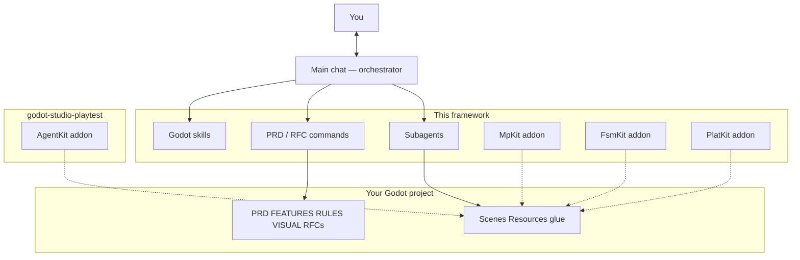
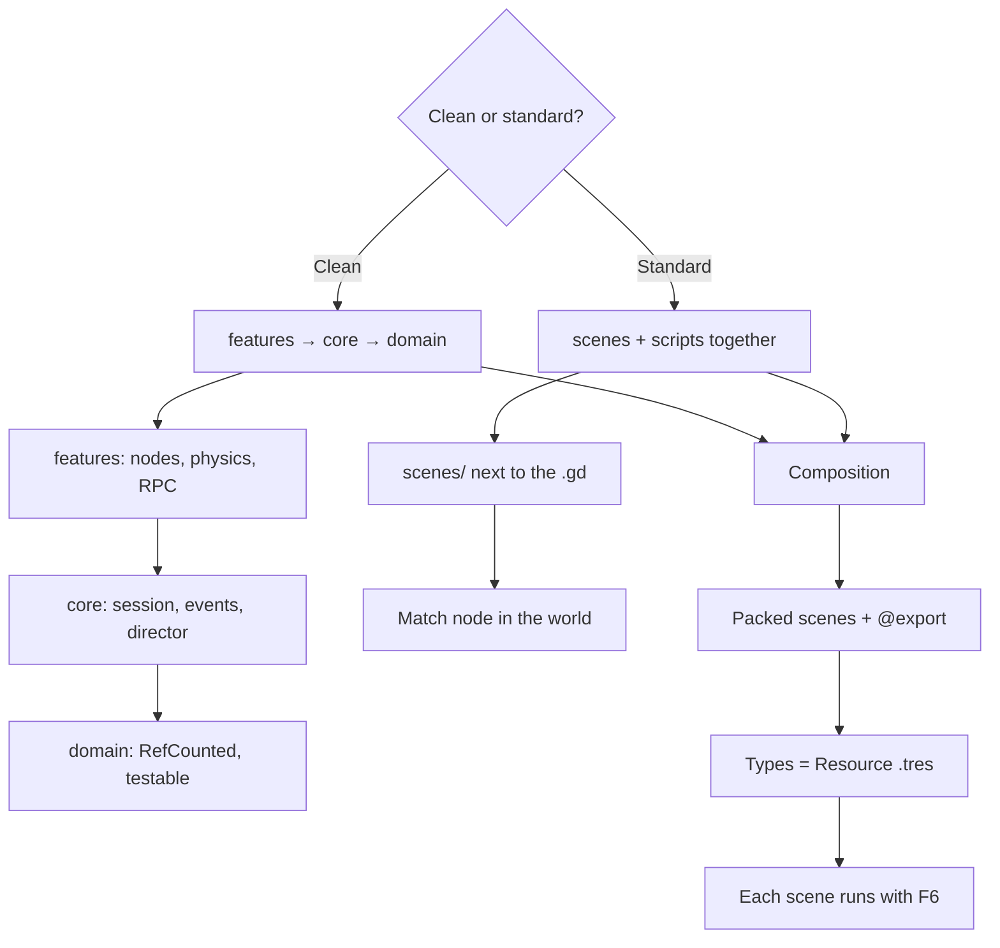
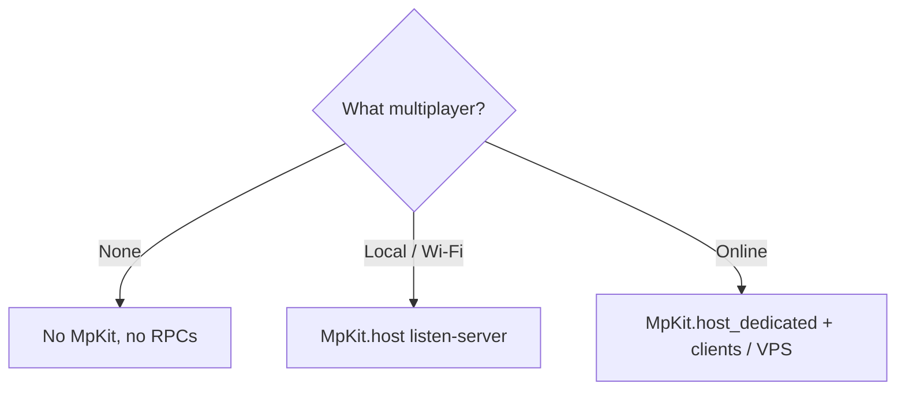
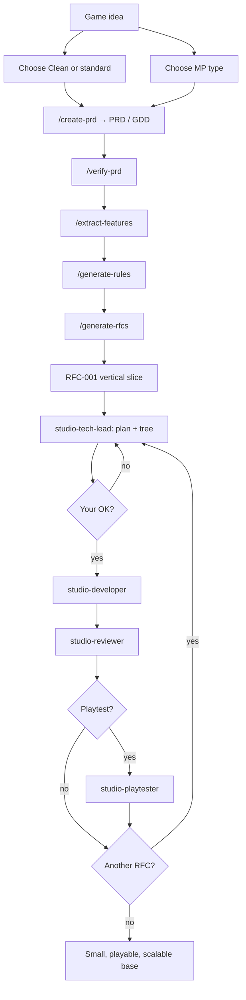

# Kit architecture

How the chat orchestrates, which Godot architectures the kit supports, and what one iteration looks like. The [README](../README.md) covers what the kit is and how to install it. Interactive diagram: [docs/diagram/](diagram/README.md).

## Orchestrator architecture

The main chat talks to you. It does not implement the title alone. It loads Godot skills, runs product commands, and invokes **one role at a time**.

Roles (`Task` → `subagent_type`):

| Role | Subagent | When |
|------|----------|------|
| Tech lead | `studio-tech-lead` | Plan for **one** RFC **with a tree**, no code |
| Developer | `studio-developer` | Implements that plan |
| Reviewer | `studio-reviewer` | After the code (one pass) |
| Tester | `studio-tester` | Only if you ask for tests or RULES requires them |
| Playtester | `studio-playtester` | Only if you agree to play the build ([playtest module](https://github.com/Joelnicolass/godot-studio-playtest); if not installed, manual playtest or skip) |
| Visual | `studio-visual` | Only if you ask for a UI pass; needs `VISUAL.md` or refs |

Subagents **do not** see this chat. The prompt passes repo, RFC, architecture style, and tells them to read the artifacts.

## Godot architectures (always ask)

Two styles are valid. The agent does not assume Clean. Both require composition, the editor, and Resources.

| Style | Shape | Match state |
|--------|--------|-------------|
| **Clean** | `src/domain` + `core` + `features` | `GameSession` autoload **only** if it survives scene change |
| **Standard** | Scene + script together; no `src/domain/` | `Match` node, child of the world |

Type data → Resource. Pure helpers → `class_name` + `static func`. Actor behavior → child node. Autoload only for global services (MpKit **if there is MP**, event bus).

## Multiplayer (always ask)

Do not copy `addons/mp_kit` “just in case”. Ask the type **before** RPCs or the addon.

| Type | MpKit |
|------|--------|
| **No multiplayer** | Do not install |
| **Local / Wi-Fi** | `host()` — the host process is a player |
| **Online** (internet / VPS) | `host_dedicated()` — same project, peer 1 is not a player. Develop dedicated + clients; the VPS is the same binary |

Tests: skill `godot-testing` (GUT / GdUnit4) **only** if you ask.

## Development flow

From idea to a **playable** base. The first RFC is the vertical slice, not endless infra.

In a new chat, with the kit installed, ask for the game. The orchestrator runs those commands **without** you typing every slash. Playtest and visual: the orchestrator **asks**. GUT tester only if you ask. Scope mid-build: `/manage-changes`. Where we are: `/workflow-status`.

Done when: the project parses headless, the slice plays, every criterion has review evidence, and `FEATURES.md` + memory are up to date (full checklist in the `godot-studio-workflow` skill).

## Priorities (always)

- architecture that is easy to scale and clean in layers
- composition structures always take priority
- nodes and editor configuration always take priority
- component reusability always takes priority

On **standard**, “layers” does not mean `domain/core/features` folders. It means small scripts and composition.

## Shaders, 2D sprites, and 3D

Do not invent FX or art from memory.

- Shaders: [Godot Shaders](https://godotshaders.com/shader/?orderby=date&order=DESC) first; [Shadertoy](https://www.shadertoy.com) if you need to port. One pass = one packed scene.
- 2D sprites: **ask** if you want Aseprite MCP / sprite creation, and ask for **references**. Animation: skill `godot-animation`. Juicy feel: `/add-juicy` + skill `godot-juicy`. Without OK: placeholder.
- **3D**: **ask** if you want the [Blender](https://www.blender.org/lab/mcp-server/) MCP. If yes: install it (Blender 5.1 + Lab add-on + server in Cursor), ask for references, export `.glb` into the game. Without OK: placeholder. Details: `skills/godot-composition-first/assets.md`.
