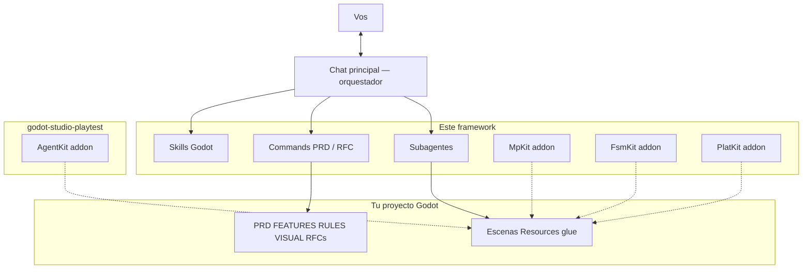
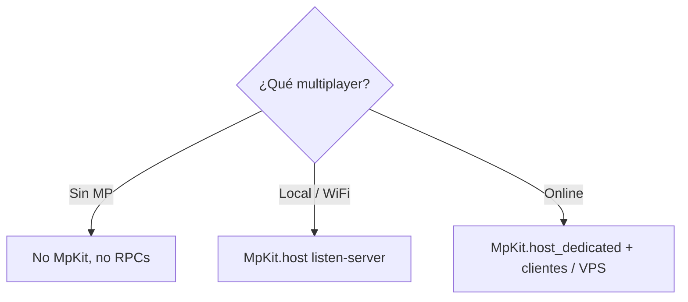
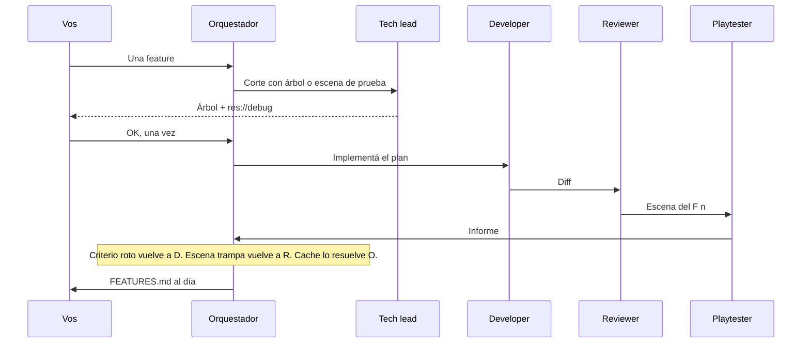

# Arquitectura del kit

Cómo orquesta el chat, qué arquitecturas Godot soporta y cómo es el flujo de una iteración. El [README](../README.md) tiene el qué y el cómo instalar. Diagrama interactivo: [docs/diagram/](diagram/README.md).

## Arquitectura del orquestador

El chat principal habla con vos. No implementa el título solo. Carga skills Godot, corre commands de producto, e invoca **un rol a la vez**.

Roles (`Task` → `subagent_type`):

| Rol | Subagente | Cuándo |
|-----|-----------|--------|
| Tech lead | `studio-tech-lead` | Plan de **un** RFC **con árbol**, sin código |
| Developer | `studio-developer` | Implementa ese plan |
| Reviewer | `studio-reviewer` | Después del código (un pase) |
| Tester | `studio-tester` | Solo si pedís tests o RULES los exige |
| Playtester | `studio-playtester` | Después del review, juega la escena del `F<n>`. Módulo [playtest](https://github.com/Joelnicolass/godot-studio-playtest). Si no está instalado: checklist manual o se saltea |
| Visual | `studio-visual` | Solo si pedís pase UI; hace falta `VISUAL.md` o refs |

Los subagentes **no** ven este chat. El prompt les pasa repo, RFC, estilo de arquitectura, y que lean los artefactos.

## Arquitecturas Godot (siempre se pregunta)

Hay **dos** estilos válidos. El agente no asume Clean. En ambos mandan composición, editor y Resources.

```mermaid
flowchart TB
  ask{¿Clean o estándar?}

  ask -->|Clean| clean[features → core → domain]
  ask -->|Estándar| std[escenas + scripts juntos]

  clean --> feat[features: nodos, física, RPC]
  feat --> core[core: sesión, eventos, director]
  core --> domain[domain: RefCounted, testeable]

  std --> scenes[scenes/ junto al .gd]
  scenes --> match[nodo Match en el mundo]

  clean --> shared[Composición]
  std --> shared

  shared --> packed[Packed scenes + @export]
  packed --> tres[Tipos = Resource .tres]
  tres --> f6[Cada escena corre con F6]
```

| Estilo | Forma | Estado de partida |
|--------|--------|-------------------|
| **Clean** | `src/domain` + `core` + `features` | `GameSession` autoload **solo** si sobrevive el cambio de escena |
| **Estándar** | Escena + script juntos; sin `src/domain/` | Nodo `Match` hijo del mundo |

Dato de tipo → Resource. Helpers puros → `class_name` + `static func`. Comportamiento de actor → nodo hijo. Autoload solo para servicios globales (MpKit **si hay MP**, bus de eventos).

## Multiplayer (siempre se pregunta)

No copies `addons/mp_kit` “por las dudas”. Preguntá el tipo **antes** de RPCs o del addon.

| Tipo | MpKit |
|------|--------|
| **Sin multiplayer** | No se instala |
| **Local / WiFi** | `host()` — el proceso host es un jugador |
| **Online** (internet / VPS) | `host_dedicated()` — mismo proyecto, peer 1 no es jugador. Desarrollá dedicated + clientes; la VPS es el mismo binario |

Tests: skill `godot-testing` (GUT / GdUnit4) **solo** si los pedís.

## Flujo general de desarrollo

De la idea a una base **jugable**. **Iterar gana a un PRD con todo definido.** El camino corto es `/implement-feature`. PRD/RFC siguen siendo opcionales.

La escena de prueba no la inventa quien juega. El tech lead la nombra en el árbol (`res://debug/…`, piezas del producto, estado inicial, acción del InputMap). El developer la construye. El reviewer mira que el resultado del criterio no esté ya puesto en el `.tscn`. El playtester solo corre esa escena con input mapeado. Un `.tres` de debug (más daño, mismo script) evita jugar toda la batalla; un script paralelo o un `call()` que deja el boss muerto no prueba la feature.

En un chat nuevo, con el kit instalado, pedí el juego o **una feature**. El orquestador corre `/implement-feature` **sin** exigir un GDD completo. Playtest y visual: el orquestador **pregunta**. Tester GUT solo si los pedís. Un RFC grande: `/implement-rfc`. Alcance a mitad de un RFC: `/manage-changes`. Dónde estamos: `/workflow-status`.

Listo cuando: el proyecto parsea headless, el slice se juega, cada criterio tiene evidencia del review, y `FEATURES.md` + memoria quedan al día (checklist completo en la skill `godot-studio-workflow`).

## Prioridades (siempre)

- arquitectura fácil de escalar y limpia en capas
- siempre tienen prioridad las estructuras de composición
- siempre tienen prioridad los nodos y las configuraciones sobre el editor
- siempre se debe dar prioridad a la reusabilidad de los componentes

En **estándar**, “capas” no significa carpetas `domain/core/features`. Significa scripts chicos y composición.

## Shaders, sprites 2D y 3D

No inventar FX ni arte de memoria.

- Shaders: [Godot Shaders](https://godotshaders.com/shader/?orderby=date&order=DESC) primero; [Shadertoy](https://www.shadertoy.com) si hay que portar. Un pass = una packed scene.
- Sprites 2D: **preguntá** si querés MCP Aseprite / crear sprites, y pedí **referencias**. Animación: skill `godot-animation`. Feel jugoso: `/add-juicy` + skill `godot-juicy`. Sin OK: placeholder.
- **3D**: **preguntá** si querés el MCP de [Blender](https://www.blender.org/lab/mcp-server/). Si sí: instalalo (Blender 5.1 + add-on Lab + server en Cursor), pedí referencias, exportá `.glb` al juego. Sin OK: placeholder. Detalle: `skills/godot-composition-first/assets.md`.
